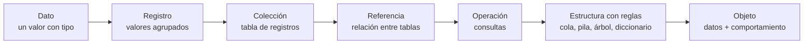
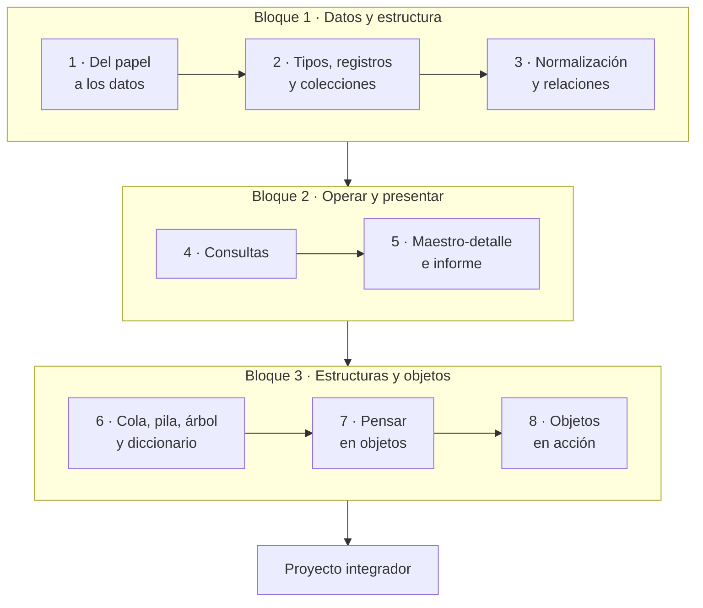

# Introducción a las Estructuras de Datos: guía del estudiante

Laboratorio: un sistema de facturación en Microsoft Access · Versión del 30 de septiembre de 2026

## Contenido

| Parte | Archivo |
| --- | --- |
| Presentación, precondiciones, mapa del curso y evaluación | Este archivo |
| Laboratorio 1 · Del papel a los datos | [lab01_del_papel_a_los_datos.md](lab01_del_papel_a_los_datos.md) |
| Laboratorio 2 · Tipos, registros y colecciones | [lab02_tipos_registros_y_colecciones.md](lab02_tipos_registros_y_colecciones.md) |
| Laboratorio 3 · Normalización y relaciones | [lab03_normalizacion_y_relaciones.md](lab03_normalizacion_y_relaciones.md) |
| Laboratorio 4 · Consultas | [lab04_consultas.md](lab04_consultas.md) |
| Laboratorio 5 · Maestro-detalle e informe | [lab05_maestro_detalle_e_informe.md](lab05_maestro_detalle_e_informe.md) |
| Laboratorio 6 · Cola, pila, árbol y diccionario | [lab06_cola_pila_arbol_diccionario.md](lab06_cola_pila_arbol_diccionario.md) |
| Laboratorio 7 · Pensar en objetos | [lab07_pensar_en_objetos.md](lab07_pensar_en_objetos.md) |
| Laboratorio 8 · Objetos en acción | [lab08_objetos_en_accion.md](lab08_objetos_en_accion.md) |
| Proyecto integrador | [proyecto_integrador.md](proyecto_integrador.md) |
| Glosario y referencia rápida | [glosario_y_referencia.md](glosario_y_referencia.md) |

## Presentación

En ocho sesiones de dos horas construirás un sistema de facturación completo en Microsoft Access. Con él aprenderás las ideas centrales de las estructuras de datos: tipos, registros, colecciones, referencias, colas, pilas, árboles, diccionarios y objetos.

Cada sesión agrega al sistema una pieza que funciona y te deja una idea nueva. El recorrido es evolutivo: cada etapa conserva la anterior y le suma algo, hasta llegar a los objetos, que unen los datos con su comportamiento.

### Qué vas a construir

Al final tendrás una base de datos `Facturacion.accdb` con clientes, productos organizados en un árbol de categorías, facturas con sus líneas y un historial de precios. Tendrá consultas de totales, un formulario de captura maestro-detalle, una factura imprimible y clases en VBA que protegen las reglas del negocio.

Es un sistema didáctico: no cumple los requisitos de facturación electrónica de ningún país.

### Al terminar el curso podrás

1. Explicar qué es una estructura de datos y elegir una según las operaciones que necesitas.
2. Elegir tipos de datos justificando dominio, tamaño y precisión.
3. Diseñar tablas con claves, índices y restricciones, y normalizarlas hasta la tercera forma normal.
4. Implementar relaciones con integridad referencial y explicar la clave foránea como una referencia.
5. Filtrar, transformar, agregar y unir colecciones con SQL.
6. Reconocer e implementar colas, pilas, árboles y diccionarios dentro de un sistema real.
7. Modelar un problema con pensamiento orientado a objetos (clases, responsabilidades y colaboraciones) e implementarlo con clases en VBA.

## Precondiciones

Necesitas una computadora con Windows y Microsoft Access de escritorio instalado y activado antes de la sesión 1. Si algo de esta lista falla, avisa a tu instructor antes de esa sesión.

### Equipo y software

| Requisito | Detalle | Cómo verificarlo |
| --- | --- | --- |
| Sistema operativo | Windows 10 u 11 (se recomienda 11). Access solo existe para PC con Windows: no hay versión para macOS, iPad ni navegador. | Configuración → Sistema → Información |
| Microsoft Access de escritorio | Versión de Microsoft 365, Access 2021 o Access 2024. Las licencias educativas Office 365 A1, A3 y A5 incluyen Access para PC ([Microsoft Education](https://www.microsoft.com/en-us/education/products/office)). | Menú Inicio → escribe «Access» → ábrelo y comprueba que no pida activación |
| Si usas Mac | Una máquina virtual con Windows o una computadora del laboratorio. | Pregunta a tu instructor qué equipo usarás |
| Espacio en disco | 500 MB libres en el disco local. | Explorador de archivos → Este equipo |
| Archivos del curso | Carpetas `datos` (archivos CSV) y `vba` (módulos de código). | Te los entrega tu instructor |
| Navegador web (opcional) | Para editar diagramas en [mermaid.live](https://mermaid.live). También puedes dibujarlos en papel. | Abre la página y escribe un diagrama de prueba |

La guía usa los menús de Access en español. La primera vez que aparece una opción, su nombre en inglés va entre paréntesis.

### Conocimientos previos

- Manejo básico de Windows: carpetas, extensiones de archivo, copiar y pegar.
- Uso básico de una hoja de cálculo: filas, columnas y fórmulas simples.
- Programación básica en cualquier lenguaje: variables, condicionales, ciclos y funciones. La usarás en las sesiones 6, 7 y 8.
- Porcentajes y redondeo.

No necesitas experiencia previa con bases de datos ni con Access.

### Configuración antes de la sesión 1

- [ ] Crea la carpeta `C:\CursoED` en el disco local, fuera de OneDrive: la sincronización puede dañar un archivo de Access abierto.
- [ ] Copia dentro de `C:\CursoED` las carpetas `datos` y `vba` del paquete del curso.
- [ ] En el Explorador de archivos activa Vista → Mostrar → Extensiones de nombre de archivo.
- [ ] Abre Access una vez y confirma que no muestra avisos de activación de la licencia.

La ubicación de confianza de Access se configura en la sesión 1, paso a paso.

## Mapa del curso

El curso tiene tres bloques: primero das forma a los datos, luego los operas y presentas, y al final los proteges con estructuras y objetos. Cada sesión deja una tarea que se entrega antes de la siguiente.

| Sesión | Idea de estructuras de datos | Lo que construyes | Tarea |
| --- | --- | --- | --- |
| 1 · Del papel a los datos | Dato, información, entidad, atributo y registro | La base de datos en una ubicación de confianza y el primer modelo entidad-relación | Modelar un recibo de pago |
| 2 · Tipos, registros y colecciones | Tipos y precisión; la tabla como colección; búsqueda lineal frente a indexada | `tblClientes` y `tblProductos` con validaciones, índices y datos importados | Tabla de proveedores y experimento de búsqueda |
| 3 · Normalización y relaciones | Redundancia, formas normales, referencias e integridad | `tblCategorias`, `tblFacturas`, `tblDetalleFactura` y sus relaciones | Normalizar una tabla de pedidos |
| 4 · Consultas | Recorrer, filtrar, transformar, agregar y unir colecciones | Importes, subtotales, impuestos, totales y ventas por cliente | Ventas por producto y por mes |
| 5 · Maestro-detalle e informe | Jerarquía padre-hijo | Formulario de facturas con sus líneas y la factura imprimible | Informe de estado de cuenta |
| 6 · Cola, pila, árbol y diccionario | Estructuras con disciplina de acceso | Cola de cobranza, deshacer cambios de precio y árbol de categorías | Ruta y profundidad en el árbol |
| 7 · Pensar en objetos | Objeto, clase, responsabilidad, colaboración y encapsulamiento | Modelo de clases y diagrama de estados de la factura | Modelar pagos parciales |
| 8 · Objetos en acción | Clases, composición, invariantes y persistencia | Clases en VBA que emiten facturas respetando sus reglas | Proyecto integrador |

## Cómo trabajar en el laboratorio

Trabajarás siempre sobre una sola base de datos, `C:\CursoED\Facturacion.accdb`, que crece sesión a sesión. Al terminar cada sesión haz una copia de seguridad.

### Estructura de cada laboratorio

1. Objetivos: lo que podrás hacer al terminar.
2. Conceptos: la idea de estructuras de datos, con diagramas.
3. Paso a paso: instrucciones numeradas en Access.
4. Puntos de control: resultados que debes ver antes de seguir.
5. Tarea: se entrega antes de la sesión siguiente.
6. Autoevaluación: preguntas para comprobar tu comprensión.

### Recuadros

- **Concepto:** la idea teórica detrás de un paso.
- **Conexión:** cómo se llama esa idea en estructuras de datos o en programación.
- **Ojo:** un error frecuente y cómo evitarlo.
- **Captura sugerida:** lugar para una imagen de pantalla que tu instructor puede agregar con su versión de Access.

### Convenciones de nombres

| Objeto | Prefijo | Ejemplo |
| --- | --- | --- |
| Tabla | `tbl` | `tblFacturas` |
| Consulta | `qry` | `qryTotalesFactura` |
| Formulario | `frm` | `frmFacturas` |
| Subformulario | `sfrm` | `sfrmDetalleFactura` |
| Informe | `rpt` | `rptFactura` |
| Módulo estándar | `mod` | `modEstructuras` |
| Módulo de clase | `cls` | `clsFactura` |

Los nombres de objetos y campos van sin espacios, sin acentos y sin ñ, con mayúscula al inicio de cada palabra: `IdCliente`, `PrecioUnitario`. Esos nombres se escriben en SQL y en VBA, y los espacios obligan a usar corchetes en todas partes.

### Copias de seguridad

- Al final de cada sesión: Archivo → Guardar como → Hacer copia de seguridad de la base de datos (Back Up Database). Access propone un nombre con la fecha.
- Una vez por semana: Herramientas de base de datos → Compactar y reparar base de datos (Compact and Repair Database).
- Si algo se daña, abre la copia más reciente y repite solo los pasos de esa sesión.

Las tareas son individuales. En la sesión 7 trabajarás en equipos de tres o cuatro personas.

## Evaluación

Tu calificación combina las tareas de laboratorio (50 %), el proyecto integrador (35 %) y la autoevaluación con participación (15 %). Tu instructor puede ajustar estos pesos.

| Componente | Peso | Qué se evalúa |
| --- | --- | --- |
| Tareas de las sesiones 1 a 7 | 50 % | Que funcione, que justifiques tus decisiones de diseño y que los diagramas sean correctos |
| Proyecto integrador | 35 % | Modelo de datos, modelo de objetos, implementación, pruebas y presentación |
| Autoevaluación y participación | 15 % | Preguntas al cierre de cada laboratorio y trabajo durante la sesión |

### Rúbrica de las tareas

| Criterio | Peso | Nivel excelente |
| --- | --- | --- |
| Funcionamiento | 40 % | Todo lo pedido funciona y pasa los puntos de control |
| Justificación | 30 % | Cada decisión (tipo, clave, relación, clase) tiene una razón explícita |
| Modelado | 20 % | Los diagramas Mermaid son correctos y coinciden con lo construido |
| Presentación | 10 % | Nombres según la convención, respuestas claras y entrega a tiempo |

### Entrega de cada tarea

Entrega tu `Facturacion.accdb` con tu apellido en el nombre (por ejemplo `Facturacion_Perez.accdb`) y un PDF breve con respuestas y diagramas. El plazo es el inicio de la sesión siguiente.

## Archivos que usarás

| Laboratorio | Archivos del paquete del curso |
| --- | --- |
| 1 · Del papel a los datos | Ninguno: la factura modelo está en la guía |
| 2 · Tipos, registros y colecciones | `datos\clientes.csv`, `datos\productos.csv`, `vba\modRegistros.bas` |
| 3 · Normalización y relaciones | `datos\factura_plana.csv`, `datos\categorias.csv`, `datos\facturas.csv`, `datos\detalle_factura.csv` |
| 4 · Consultas | Ninguno |
| 5 · Maestro-detalle e informe | Ninguno |
| 6 · Cola, pila, árbol y diccionario | `vba\modEstructuras.bas` |
| 7 · Pensar en objetos | Ninguno: papel, tarjetas y mermaid.live |
| 8 · Objetos en acción | `vba\modConstantes.bas`, `vba\clsLineaFactura.cls`, `vba\clsFactura_plantilla.cls`, `vba\clsRepositorioFacturas.cls`, `vba\modPruebasObjetos.bas` |

Los datos de ejemplo son ficticios: 8 clientes, 15 productos, 11 categorías y 7 facturas con 16 líneas.

## Cómo importar un módulo de código

Los laboratorios 2, 6 y 8 usan archivos `.bas` (módulos estándar) y `.cls` (módulos de clase).

1. Con tu base abierta, presiona Alt+F11 para abrir el editor de Visual Basic.
2. Elige Archivo → Importar archivo (File → Import File) y selecciona el archivo en `C:\CursoED\vba`.
3. Elige Depuración → Compilar (Debug → Compile). Si no aparece ningún mensaje, el código está bien.
4. Guarda con Ctrl+S y vuelve a Access con Alt+F11.

Para ejecutar un procedimiento, abre la ventana Inmediato con Ctrl+G, escribe su nombre y presiona Enter.

> **Ojo:** el código solo se ejecuta si la base está en una ubicación de confianza (laboratorio 1) o si pulsas «Habilitar contenido» en la barra amarilla.
