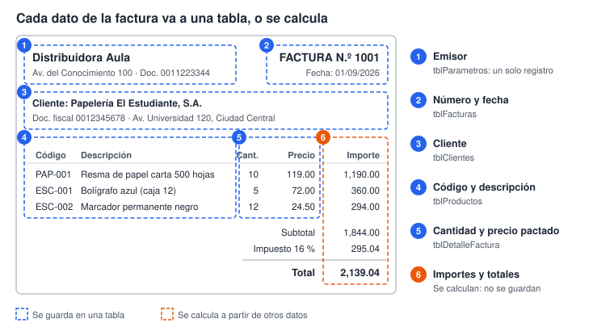
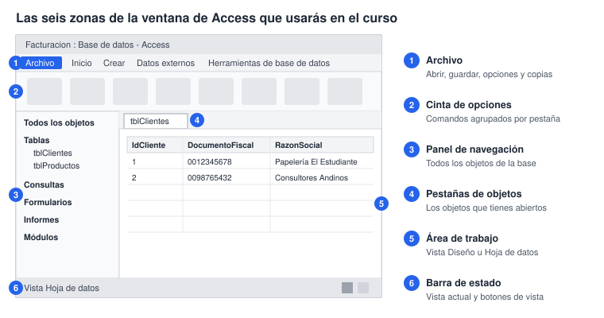
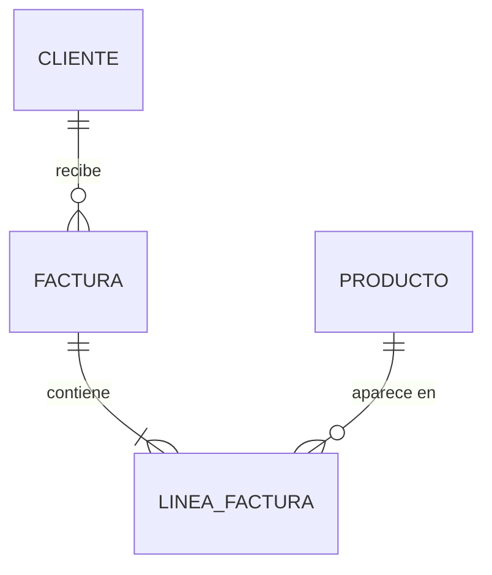
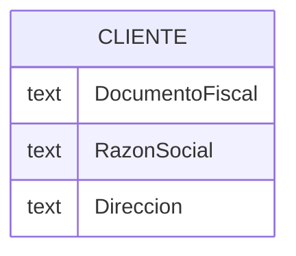

# Laboratorio 1 · Del papel a los datos

En esta sesión conviertes una factura en papel en un modelo de datos y creas la base de datos donde vivirá el sistema.

## Objetivos

- Distinguir dato, información y estructura de datos.
- Identificar entidades, atributos y registros en un documento real.
- Separar los datos que se guardan de los que se calculan.
- Crear la base de datos en una ubicación de confianza y reconocer los objetos de Access.
- Dibujar un primer modelo entidad-relación en Mermaid.

## Conceptos

**Dato, información y estructura.** Un dato es un valor aislado: `119.00`. Se vuelve información cuando sabes qué significa: el precio de una resma de papel el 1 de septiembre. Una estructura de datos es la forma de organizar muchos datos para guardarlos, buscarlos, relacionarlos y cambiarlos con eficiencia.

**Entidad, atributo y registro.** Una entidad es algo del problema sobre lo que guardas datos: un cliente, un producto, una factura. Sus atributos son las características que te interesan: razón social, precio, fecha. Un registro agrupa los valores de una sola ocurrencia: el cliente 1 con todos sus datos.

> **Conexión:** un registro es lo que en programación llamas estructura: `struct` en C o `Type` en VBA. En la sesión 2 lo verás en código.

**Guardar o calcular.** El importe de una línea es la cantidad por el precio. Si lo guardas y alguien corrige la cantidad, el importe queda mal. Regla práctica: guarda los datos de origen y calcula los derivados.

### La factura modelo

## Paso a paso

### Parte A · Analiza la factura, sin computadora (25 min)

1. Haz una lista de todos los datos que aparecen en la factura modelo.
2. Clasifica cada dato en una tabla como esta, en tu cuaderno:

| Dato | Ejemplo | Entidad | ¿Se guarda o se calcula? |
| --- | --- | --- | --- |
| Número de factura | 1001 | Factura | Se guarda |
| Razón social | Papelería El Estudiante, S.A. | Cliente | Se guarda |
| Importe de la línea | 1,190.00 | Línea de factura | Se calcula |

3. Agrupa los datos por entidad. Deberían salirte cuatro principales: Cliente, Producto, Factura y Línea de factura.
4. Discute con tu compañero qué hacer con los datos del emisor, que se repiten idénticos en todas las facturas.
5. Para cada entidad, elige el atributo que distingue un registro de todos los demás. Ese atributo es un candidato a clave.

### Parte B · Prepara Access (20 min)

1. Comprueba que existe `C:\CursoED` con las carpetas `datos` y `vba`.
2. Abre Access y elige Archivo → Opciones → Centro de confianza → Configuración del Centro de confianza → Ubicaciones de confianza (File → Options → Trust Center → Trust Center Settings → Trusted Locations).
3. Pulsa Agregar nueva ubicación, elige `C:\CursoED`, marca «Las subcarpetas de esta ubicación también son de confianza» y acepta todas las ventanas.
4. Elige Archivo → Nuevo → Base de datos en blanco (Blank database). Nombre: `Facturacion.accdb`. Carpeta: `C:\CursoED`. Pulsa Crear.
5. Access abre una tabla vacía llamada Tabla1. Ciérrala sin guardar.

> **Captura sugerida:** la ventana Ubicaciones de confianza con `C:\CursoED` agregada.

### Parte C · Recorre la interfaz (15 min)

| Objeto | Para qué sirve | Lo usarás en |
| --- | --- | --- |
| Tabla | Guarda los datos en filas y columnas | Sesiones 2 y 3 |
| Consulta | Pregunta, calcula y combina datos | Sesión 4 |
| Formulario | Captura y consulta en pantalla | Sesión 5 |
| Informe | Presenta datos para imprimir | Sesión 5 |
| Macro | Automatiza acciones sin código | No se usa en este curso |
| Módulo | Guarda código VBA | Sesiones 2, 6 y 8 |

Cada objeto tiene al menos dos vistas. La vista Diseño (Design) muestra la estructura y la vista Hoja de datos (Datasheet) muestra los datos. Esa separación entre estructura y contenido es la idea central del curso.

> **Concepto:** Access es un sistema gestor de bases de datos relacional de escritorio. Tablas, consultas, formularios y código viven en un solo archivo `.accdb`, que puede crecer hasta 2 GB.

### Parte D · Tu primer modelo entidad-relación (25 min)

1. Abre [mermaid.live](https://mermaid.live) o usa papel.
2. Copia este inicio. Cada línea une dos entidades y dice cuántos registros de un lado corresponden al otro.

3. Lee los extremos: `||` significa exactamente uno, `o{` cero o muchos y `|{` uno o muchos. Un cliente recibe cero o muchas facturas; una factura contiene una o muchas líneas.
4. Agrega los atributos de tu tabla de análisis a cada entidad, con esta forma:

5. Haz la copia de seguridad de la base (Archivo → Guardar como → Hacer copia de seguridad de la base de datos).

## Puntos de control

- [ ] Tu tabla de análisis clasifica al menos 15 datos.
- [ ] `C:\CursoED` aparece en Ubicaciones de confianza.
- [ ] `Facturacion.accdb` abre sin la barra amarilla de advertencia de seguridad.
- [ ] Tu diagrama tiene 4 entidades, 3 relaciones y los atributos de cada entidad.

## Tarea 1 · Modela un recibo de pago

Cuando un cliente paga, la empresa le entrega un recibo con número, fecha, cliente, forma de pago (efectivo, tarjeta o transferencia) y monto recibido. El recibo lista las facturas que ese pago cubre y el monto aplicado a cada una.

Entrega:

1. La tabla de análisis de los datos del recibo.
2. El diagrama entidad-relación en Mermaid, con atributos y cardinalidades.
3. Una respuesta breve: ¿un pago puede cubrir varias facturas? ¿Una factura puede pagarse con varios recibos? ¿Qué tipo de relación resulta y cómo la representarías?

## Autoevaluación

1. ¿Por qué el total de una factura no debería guardarse como un dato más?
2. ¿Qué diferencia hay entre una entidad y un registro?
3. ¿Qué pasa al abrir una base que no está en una ubicación de confianza?
4. En `CLIENTE ||--o{ FACTURA`, ¿qué significa cada extremo?
