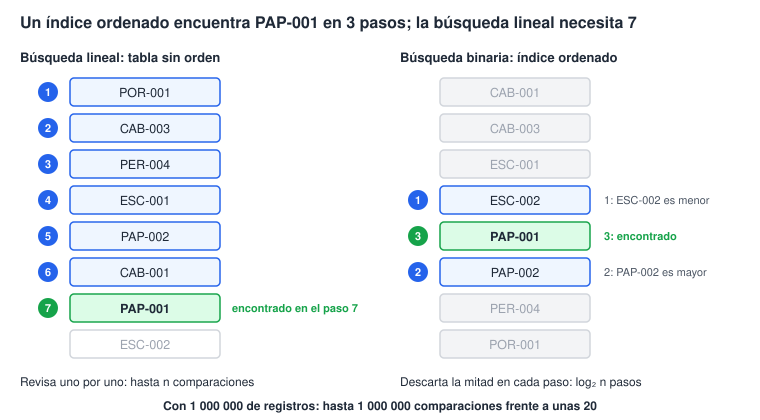

# Laboratorio 2 · Tipos, registros y colecciones

Hoy creas las tablas de clientes y productos eligiendo cada tipo de dato con una razón, cargas los datos y comparas dos formas de buscar.

## Objetivos

- Elegir el tipo de cada atributo según su dominio, tamaño y precisión.
- Crear tablas en vista Diseño con clave principal, reglas de validación y valores predeterminados.
- Explicar una tabla como una colección de registros y su clave como identidad.
- Importar datos desde CSV controlando fechas, decimales y codificación.
- Comparar la búsqueda lineal con la búsqueda sobre un índice.

## Conceptos

**Tipo de dato.** Un tipo define qué valores admite un dato, cuánto espacio ocupa y qué operaciones permite. Elegirlo bien evita errores que ninguna validación posterior corrige.

| Tipo en Access (inglés) | Guarda | Tamaño | Úsalo para |
| --- | --- | --- | --- |
| Texto corto (Short Text) | Hasta 255 caracteres | Variable | Nombres, códigos, teléfonos |
| Texto largo (Long Text) | Textos extensos | Variable | Observaciones |
| Número, Entero largo (Long Integer) | Enteros entre −2 147 483 648 y 2 147 483 647 | 4 bytes | Cantidades y claves foráneas |
| Número, Doble (Double) | Decimales en coma flotante binaria | 8 bytes | Medidas y tasas |
| Moneda (Currency) | Decimales exactos con 4 cifras después del punto | 8 bytes | Dinero |
| Fecha/Hora (Date/Time) | Fecha y hora | 8 bytes | Fechas |
| Sí/No (Yes/No) | Verdadero o falso | 1 bit | Indicadores |
| Autonumeración (AutoNumber) | Entero largo que asigna Access | 4 bytes | Claves sustitutas |

> **Ojo:** el teléfono y el documento fiscal son texto aunque tengan dígitos. No se suman, pueden empezar con cero y pueden llevar guiones.

**Por qué el dinero no va en Doble.** Doble guarda los números en base 2, y 0.1 no tiene representación exacta en base 2. Moneda guarda un entero escalado por 10 000, así que los centavos son exactos.

> **Conexión:** es el mismo problema de `float` y `double` en C, Java o Python. En Python, `0.1 + 0.2 == 0.3` también es `False`.

**La tabla como colección.** Una tabla es una colección de registros del mismo tipo: un arreglo de estructuras que vive en disco. La clave principal (primary key) es la identidad de cada registro: no se repite y no puede quedar vacía.

**Clave natural y clave sustituta.** El código `PAP-001` es una clave natural: viene del negocio y alguien podría cambiarla. `IdProducto` es una clave sustituta: la genera el sistema y no cambia nunca. Usamos la sustituta como clave principal y protegemos la natural con un índice único.

**Índice.** Un índice es una estructura auxiliar ordenada que Access mantiene junto a la tabla. Sin él, buscar un código obliga a revisar los registros uno por uno. Con él, cada comparación descarta la mitad de los candidatos.



| Registros (n) | Búsqueda lineal, peor caso | Con índice, aproximado (log₂ n) |
| --- | --- | --- |
| 1 000 | 1 000 comparaciones | 10 comparaciones |
| 1 000 000 | 1 000 000 comparaciones | 20 comparaciones |

> **Ojo:** un índice acelera las búsquedas, pero ocupa espacio y hace más lentas las altas y los cambios. Indexa lo que buscas, ordenas o relacionas, no todo.

## Paso a paso

### Parte A · El problema de los decimales (10 min)

1. En Access presiona Alt+F11 y luego Ctrl+G para abrir la ventana Inmediato (Immediate).
2. Escribe cada línea y presiona Enter:

```vb
? 0.1 + 0.2
? 0.1 + 0.2 = 0.3
? 0.1 + 0.2 - 0.3
? CCur(0.1) + CCur(0.2) = CCur(0.3)
```

3. Anota los resultados. La primera muestra 0.3, pero la segunda responde Falso y la tercera muestra una diferencia diminuta. La cuarta, con Moneda, responde Verdadero.

### Parte B · Crea tblClientes (25 min)

1. Elige Crear → Diseño de tabla (Create → Table Design).
2. Define los campos y sus propiedades, en la parte inferior de la ventana:

| Campo | Tipo | Propiedades |
| --- | --- | --- |
| `IdCliente` | Autonumeración | Clave principal |
| `DocumentoFiscal` | Texto corto | Tamaño 20 · Requerido: Sí · Indexado: Sí (Sin duplicados) |
| `RazonSocial` | Texto corto | Tamaño 100 · Requerido: Sí |
| `Direccion` | Texto corto | Tamaño 150 |
| `Ciudad` | Texto corto | Tamaño 60 |
| `Telefono` | Texto corto | Tamaño 20 |
| `Correo` | Texto corto | Tamaño 100 · Regla de validación: `Like "*@*.*" Or Is Null` · Texto de validación: El correo no tiene un formato válido. |
| `FechaAlta` | Fecha/Hora | Valor predeterminado: `Date()` |

3. Selecciona la fila `IdCliente` y pulsa Diseño → Clave principal (Primary Key).
4. Guarda la tabla como `tblClientes`.

> **Ojo · Access en español:** las expresiones pueden mostrarse traducidas, por ejemplo `Como "*@*.*" O Es Nulo` y `Fecha()`. Si Access rechaza la versión en inglés, escribe la versión en español.

### Parte C · Crea tblProductos (15 min)

| Campo | Tipo | Propiedades |
| --- | --- | --- |
| `IdProducto` | Autonumeración | Clave principal |
| `Codigo` | Texto corto | Tamaño 15 · Requerido: Sí · Indexado: Sí (Sin duplicados) |
| `Descripcion` | Texto corto | Tamaño 100 · Requerido: Sí |
| `IdCategoria` | Número | Entero largo · Requerido: Sí |
| `Precio` | Moneda | Requerido: Sí · Regla de validación: `>=0` · Texto de validación: El precio no puede ser negativo. |
| `Existencia` | Número | Entero largo · Valor predeterminado: 0 · Regla de validación: `>=0` |
| `Activo` | Sí/No | Valor predeterminado: `-1` (verdadero) |

> **Conexión:** por ahora `IdCategoria` es solo un número. En la sesión 3 se convertirá en una referencia a otra tabla.

### Parte D · Prueba las restricciones (10 min)

1. Abre `tblProductos` en vista Hoja de datos e intenta guardar un producto con precio −5.
2. En `tblClientes`, intenta guardar un cliente sin razón social.
3. Agrega dos clientes con el mismo documento fiscal.
4. Escribe `hola` como correo de un cliente.
5. Access debe rechazar los cuatro intentos. Después borra todos los registros de prueba.

### Parte E · Importa los datos (25 min)

1. Elige Datos externos → Nuevo origen de datos → Desde archivo → Archivo de texto (External Data → New Data Source → From File → Text File).
2. Selecciona `C:\CursoED\datos\clientes.csv` y la opción «Anexar una copia de los registros a la tabla» con `tblClientes`.
3. Elige Delimitado. Separador: coma. Marca «La primera fila contiene los nombres de los campos». Calificador de texto: comillas dobles.
4. Pulsa Avanzado (Advanced): orden de fecha AMD, delimitador de fecha `-`, años en cuatro dígitos marcado, símbolo decimal `.` y código de página Europeo occidental (Windows).
5. Termina el asistente sin guardar los pasos de importación.
6. Repite con `productos.csv` sobre `tblProductos`.

> **Concepto:** un CSV es texto plano, así que fechas y decimales viajan como texto y cada país los escribe distinto. Los archivos del curso usan fechas ISO (2026-09-01) y punto decimal para no depender de la configuración regional.

> **Ojo:** si Access avisa que no pudo anexar registros, revisa que borraste los registros de prueba y que elegiste la tabla correcta.

### Parte F · Registros y búsqueda en código (10 min)

1. Importa `vba\modRegistros.bas` (ver «Cómo importar un módulo de código» en `00_inicio.md`). Contiene este registro:

```vb
Public Type TProducto
    Codigo As String
    Descripcion As String
    Precio As Currency
End Type
```

2. En la ventana Inmediato ejecuta `DemoRegistro` y después `CompararBusquedas 100000`.
3. Compara los pasos: la búsqueda lineal revisa 100 000 elementos y la binaria unos 17.
4. Haz la copia de seguridad de la base.

## Puntos de control

- [ ] En la ventana Inmediato, `? 0.1 + 0.2 = 0.3` devolvió Falso.
- [ ] `tblClientes` tiene 8 registros y `tblProductos` tiene 15.
- [ ] Access rechaza un precio negativo y un documento fiscal repetido.
- [ ] La ventana Diseño → Índices de `tblProductos` muestra `PrimaryKey` y el índice único de `Codigo`.
- [ ] `CompararBusquedas 100000` muestra unos 17 pasos para la búsqueda binaria.

## Tarea 2 · Proveedores y experimento de búsqueda

1. Diseña y crea `tblProveedores` con al menos siete campos. Justifica en una línea el tipo, el tamaño y las restricciones de cada uno.
2. Ejecuta `CompararBusquedas` con n = 1 000, 10 000 y 100 000. Registra los pasos en una tabla y grafícalos. ¿Cómo crece cada curva cuando n se multiplica por 10?
3. Responde: ¿por qué no conviene indexar todos los campos de una tabla?

## Autoevaluación

1. ¿Qué tipo usarías para un código postal y por qué?
2. ¿Por qué el dinero se guarda en Moneda y no en Doble?
3. ¿Qué diferencia hay entre una clave natural y una sustituta? Da un ejemplo de cada una en este sistema.
4. Si una búsqueda binaria necesita 20 pasos para un millón de registros, ¿cuántos necesita para dos millones?
