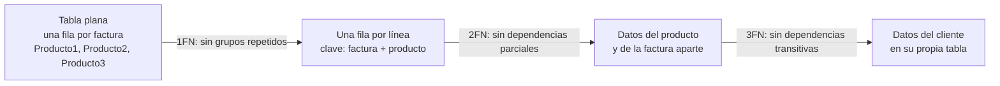
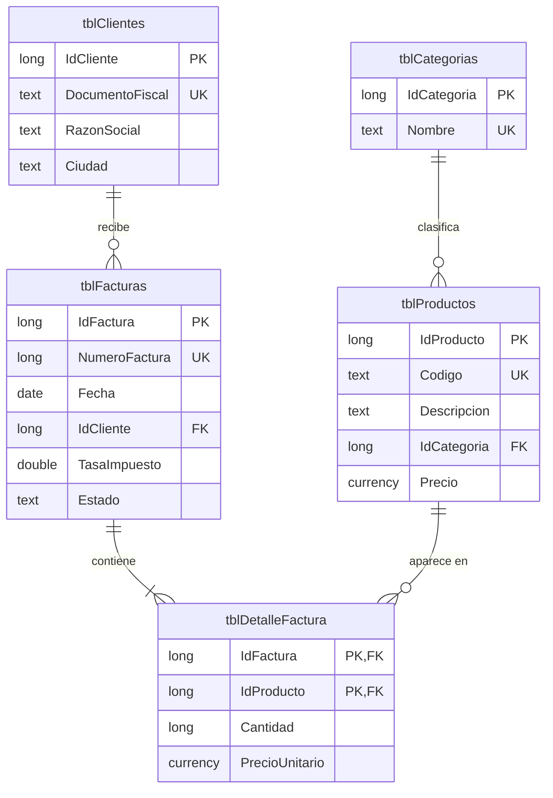

# Laboratorio 3 · Normalización y relaciones

Hoy partes de facturas guardadas en una sola tabla plana, descubres sus problemas y las divides en tablas relacionadas que Access protege con integridad referencial.

## Objetivos

- Detectar redundancia y anomalías de actualización, inserción y borrado.
- Aplicar la primera, segunda y tercera formas normales.
- Implementar relaciones uno a muchos con integridad referencial.
- Resolver una relación muchos a muchos con una tabla intermedia.
- Explicar la clave foránea como una referencia entre registros.

## Conceptos

**Redundancia y anomalías.** Una tabla plana repite datos: el nombre del cliente aparece en cada una de sus facturas. Esa repetición produce tres anomalías.

| Anomalía | Qué pasa en `factura_plana.csv` |
| --- | --- |
| Actualización | Si el cliente cambia de dirección hay que corregir todas sus filas; si olvidas una, los datos se contradicen |
| Inserción | No puedes registrar un cliente nuevo hasta que compre algo |
| Borrado | Si borras la única factura de un cliente, pierdes también al cliente |

**Dependencia funcional.** Un campo B depende de un campo A cuando conocer A basta para saber B. Se escribe A → B. En `factura_plana.csv`, `DocCliente → CiudadCliente`: con el documento fiscal sabes la ciudad. Al revés no, porque en una ciudad hay muchos clientes. Las formas normales se definen con esta idea.

**Formas normales.** Son reglas acumulativas: cada una exige la anterior y elimina un tipo más de redundancia.

| Forma | Exige | Elimina |
| --- | --- | --- |
| Primera (1FN) | Un solo valor por celda, sin grupos repetidos, y una clave que identifique cada fila | Columnas repetidas y listas dentro de una celda |
| Segunda (2FN) | 1FN, y que cada campo fuera de la clave dependa de la clave completa | Dependencias parciales |
| Tercera (3FN) | 2FN, y que ningún campo fuera de la clave dependa de otro campo fuera de la clave | Dependencias transitivas |
| Boyce-Codd (FNBC) | 3FN, y que todo campo o grupo de campos que determina a otro sea clave candidata | Dependencias hacia una parte de la clave |
| Cuarta (4FN) | FNBC, y que la tabla no junte dos listas independientes | Dependencias multivaluadas |
| Quinta (5FN) | 4FN, y que la tabla no guarde como un solo hecho varios hechos más pequeños | Dependencias de unión |

Este laboratorio llega hasta 3FN, el nivel habitual de una base bien diseñada. Las otras tres aparecen en casos especiales; las verás con ejemplos en «Para ir más allá», al final del paso a paso.

**1FN · Un valor por celda.** `factura_plana.csv` guarda las líneas en columnas repetidas (aquí solo algunas columnas):

| NumFactura | Producto1 | Cant1 | Producto2 | Cant2 | Producto3 | Cant3 |
| --- | --- | --- | --- | --- | --- | --- |
| 1001 | Resma de papel carta 500 hojas | 10 | Bolígrafo azul (caja 12) | 5 | Marcador permanente negro | 12 |
| 1003 | Monitor 24 pulgadas Full HD | 3 | Cable HDMI 2 m | 3 | | |

La factura 1003 deja columnas vacías, y para saber quién compró un cable HDMI hay que revisar tres columnas. En 1FN cada línea ocupa su propia fila y la clave es (NumFactura, Producto):

| NumFactura | Producto | Cantidad |
| --- | --- | --- |
| 1001 | Resma de papel carta 500 hojas | 10 |
| 1001 | Bolígrafo azul (caja 12) | 5 |
| 1001 | Marcador permanente negro | 12 |

Tampoco cumple 1FN una celda con una lista, como un teléfono `555-0101, 555-0199`. Los demás datos de la factura, como la fecha y el cliente, se copian ahora en cada fila; las dos formas siguientes se ocupan de esa repetición.

**2FN · Todo depende de la clave completa.** Solo importa cuando la clave es compuesta. Con el código del producto, la tabla de 1FN tiene la clave (NumFactura, Codigo):

| NumFactura | Codigo | Descripcion | Fecha | Cantidad | PrecioUnitario |
| --- | --- | --- | --- | --- | --- |
| 1001 | PAP-001 | Resma de papel carta 500 hojas | 2026-09-01 | 10 | 119.00 |
| 1004 | PAP-001 | Resma de papel carta 500 hojas | 2026-09-10 | 5 | 119.00 |
| 1004 | ESC-003 | Cuaderno profesional 100 hojas | 2026-09-10 | 20 | 45.00 |

`Codigo → Descripcion` y `NumFactura → Fecha` son dependencias parciales: cada una usa solo una parte de la clave. Por eso la descripción de la resma se repite en cada factura que la vende y la fecha de la 1004 se repite en cada una de sus líneas. 2FN separa cada dato junto con la parte de la clave de la que depende (la clave va en negrita):

- Facturas (**NumFactura**, Fecha, …)
- Productos (**Codigo**, Descripcion)
- Líneas (**NumFactura**, **Codigo**, Cantidad, PrecioUnitario)

`Cantidad` y `PrecioUnitario` se quedan en las líneas porque dependen de la clave completa: cuánto se vendió de ese producto, y a qué precio, en esa factura.

**3FN · Nada depende de un campo que no sea clave.** Después de 2FN, la tabla de facturas todavía guarda los datos del cliente:

| NumFactura | Fecha | DocCliente | Cliente | CiudadCliente |
| --- | --- | --- | --- | --- |
| 1001 | 2026-09-01 | 0012345678 | Papelería El Estudiante, S.A. | Ciudad Central |
| 1004 | 2026-09-10 | 0012345678 | Papelería El Estudiante SA | Cd. Central |

La razón social y la ciudad dependen de `DocCliente`, y `DocCliente` depende de `NumFactura`. Es una dependencia transitiva: `NumFactura → DocCliente → CiudadCliente`. El resultado está a la vista: el mismo cliente aparece escrito de dos formas. 3FN mueve esos datos a su propia tabla y deja en la factura solo la referencia:

- Clientes (**DocCliente**, Cliente, CiudadCliente)
- Facturas (**NumFactura**, Fecha, DocCliente)

En Access la clave de `tblClientes` será la clave sustituta `IdCliente`, pero la idea es la misma.

> **Concepto:** una frase resume las tres primeras formas: cada campo debe depender de la clave (1FN), de toda la clave (2FN) y de nada más que la clave (3FN).

**No toda repetición es redundancia.** El precio unitario se guarda en cada línea aunque también esté en `tblProductos`. Es el precio histórico de esa venta: si mañana cambia el precio del producto, las facturas viejas no deben cambiar.

**La clave foránea es una referencia.** `IdCliente` en `tblFacturas` guarda el valor de la clave de un cliente: es un puntero, pero por valor. La integridad referencial impide referencias colgantes, es decir, facturas que apuntan a clientes que no existen.

> **Conexión:** una referencia colgante en una base de datos equivale a un puntero colgante (dangling pointer) en C.

**Muchos a muchos.** Una factura tiene muchos productos y un producto aparece en muchas facturas. La relación se resuelve con `tblDetalleFactura`, una tabla intermedia cuya clave combina las dos referencias y que además guarda cantidad y precio.

**Composición.** Las líneas no existen sin su factura. Por eso la relación entre facturas y detalle usa eliminación en cascada; las demás relaciones no la usan.

Este es el modelo al que llegarás hoy:

**El orden de carga es un orden topológico.** El diagrama de relaciones es un grafo dirigido del padre al hijo. Para cargar datos sin violar la integridad, primero van los padres (categorías y clientes), luego productos y facturas, y al final el detalle.

## Paso a paso

### Parte A · Analiza la tabla plana (20 min)

1. Abre `C:\CursoED\datos\factura_plana.csv` con el Bloc de notas o con Excel.
2. Marca los grupos repetidos y los datos del cliente que se repiten.
3. Compara las filas de las facturas 1001 y 1004: tienen el mismo documento fiscal, pero la razón social y la ciudad están escritas distinto.
4. Responde: ¿qué harías si una factura tuviera cuatro productos?

### Parte B · Normaliza en papel (20 min)

1. Aplica 1FN: reescribe la tabla con una fila por línea. La clave es (número de factura, producto).
2. Aplica 2FN: separa lo que depende solo de la factura (fecha, cliente) y lo que depende solo del producto (descripción).
3. Aplica 3FN: separa los datos del cliente.
4. Elimina la columna Total: se calcula.
5. Compara tu resultado con el diagrama de la sección Conceptos.

### Parte C · Crea las tablas nuevas (30 min)

1. Crea `tblCategorias`:

| Campo | Tipo | Propiedades |
| --- | --- | --- |
| `IdCategoria` | Número, Entero largo | Clave principal |
| `Nombre` | Texto corto | Tamaño 50 · Requerido: Sí · Indexado: Sí (Sin duplicados) |

2. Importa `categorias.csv` en `tblCategorias` con los mismos ajustes avanzados del laboratorio 2.
3. Crea `tblFacturas`:

| Campo | Tipo | Propiedades |
| --- | --- | --- |
| `IdFactura` | Autonumeración | Clave principal |
| `NumeroFactura` | Número, Entero largo | Indexado: Sí (Sin duplicados). Queda vacío mientras la factura es borrador |
| `Fecha` | Fecha/Hora | Requerido: Sí · Valor predeterminado: `Date()` |
| `IdCliente` | Número, Entero largo | Requerido: Sí |
| `TasaImpuesto` | Número, Doble | Formato: Porcentaje · Regla de validación: `Between 0 And 1` |
| `Estado` | Texto corto | Tamaño 10 · Requerido: Sí · Valor predeterminado: `"Borrador"` · Regla de validación: `"Borrador" Or "Emitida" Or "Pagada" Or "Anulada"` |
| `Observaciones` | Texto largo | Sin propiedades especiales |

4. Crea `tblDetalleFactura`. Para la clave compuesta, selecciona las filas `IdFactura` e `IdProducto` con Ctrl presionado y pulsa Clave principal.

| Campo | Tipo | Propiedades |
| --- | --- | --- |
| `IdFactura` | Número, Entero largo | Parte de la clave principal |
| `IdProducto` | Número, Entero largo | Parte de la clave principal |
| `Cantidad` | Número, Entero largo | Requerido: Sí · Valor predeterminado: 1 · Regla de validación: `>0` |
| `PrecioUnitario` | Moneda | Requerido: Sí · Regla de validación: `>=0` |

> **Ojo · Access en español:** si Access rechaza las reglas en inglés, escríbelas así: `Entre 0 Y 1` y `"Borrador" O "Emitida" O "Pagada" O "Anulada"`.

### Parte D · Crea las relaciones (25 min)

1. Elige Herramientas de base de datos → Relaciones (Database Tools → Relationships) y agrega las cinco tablas.
2. Arrastra `IdCliente` de `tblClientes` sobre `IdCliente` de `tblFacturas`. Marca Exigir integridad referencial (Enforce Referential Integrity) y pulsa Crear.
3. Une `tblFacturas.IdFactura` con `tblDetalleFactura.IdFactura`. Marca la integridad y también Eliminar en cascada los registros relacionados (Cascade Delete Related Records).
4. Une `tblProductos.IdProducto` con `tblDetalleFactura.IdProducto`, solo con integridad.
5. Une `tblCategorias.IdCategoria` con `tblProductos.IdCategoria`, solo con integridad.
6. Guarda el diseño de relaciones. Cada línea debe mostrar 1 en el lado padre y ∞ en el lado hijo.

> **Captura sugerida:** la ventana Relaciones con las cinco tablas y sus cuatro líneas.

> **Ojo:** si Access no deja crear una relación, revisa que ambos campos sean Entero largo y que ningún registro hijo apunte a un padre inexistente.

### Parte E · Carga en orden topológico (15 min)

1. Intenta importar primero `detalle_factura.csv` en `tblDetalleFactura`. Access no anexa las líneas: sus facturas todavía no existen.
2. Importa `facturas.csv` en `tblFacturas` y después `detalle_factura.csv` en `tblDetalleFactura`.

### Parte F · Prueba la integridad (10 min)

1. En `tblDetalleFactura`, intenta agregar una línea de la factura 1 con el producto 99.
2. En `tblClientes`, intenta borrar el cliente 1.
3. Crea una factura de prueba para el cliente 5 con una línea y después borra la factura. Su línea desaparece con ella.
4. Haz la copia de seguridad de la base.

### Para ir más allá · Formas normales superiores (opcional)

La mayoría de las tablas en 3FN cumplen también las formas siguientes. Las excepciones aparecen con claves compuestas que se superponen, con listas independientes y con reglas que combinan tres datos.

**Forma normal de Boyce-Codd (FNBC).** Todo campo o grupo de campos que determina a otro debe ser clave candidata, es decir, una combinación mínima de campos que podría servir de clave principal. 3FN deja pasar un caso que FNBC no: un campo que por sí solo no es clave determina una parte de una clave.

Cada cliente tiene un ejecutivo de cuenta por categoría, y cada ejecutivo atiende una sola categoría:

| Cliente | Categoria | Ejecutivo |
| --- | --- | --- |
| Papelería El Estudiante, S.A. | Papelería | Ana Solís |
| Papelería El Estudiante, S.A. | Tecnología | Bruno Paz |
| Escuela Técnica Horizonte | Tecnología | Bruno Paz |
| Consultores Andinos, S.R.L. | Tecnología | Carla Vega |

Las claves candidatas son (Cliente, Categoria) y (Cliente, Ejecutivo). La dependencia `Ejecutivo → Categoria` cumple 3FN porque `Categoria` forma parte de una clave, pero rompe FNBC porque `Ejecutivo` solo no es clave. Por eso el dato «Bruno Paz atiende Tecnología» se escribe dos veces, y no puedes registrar la categoría de un ejecutivo nuevo hasta que tenga un cliente. La solución guarda ese dato una sola vez:

- Ejecutivos (**Ejecutivo**, Categoria)
- Cartera (**Cliente**, **Ejecutivo**)

> **Ojo:** la nueva estructura ya no impide que un cliente tenga dos ejecutivos de la misma categoría; esa regla hay que comprobarla con una consulta o con código. Cuando FNBC obliga a perder una regla así, muchos diseños se quedan en 3FN.

**Cuarta forma normal (4FN).** Además de FNBC, una tabla no debe juntar dos listas independientes sobre la misma cosa. Supón que un cliente tiene varios teléfonos y varios correos, y que ningún correo va ligado a un teléfono concreto. Si los guardas juntos, tienes que escribir todas las combinaciones:

| Cliente | Telefono | Correo |
| --- | --- | --- |
| Consultores Andinos, S.R.L. | 555-0102 | admin@andinos.example |
| Consultores Andinos, S.R.L. | 555-0102 | compras@andinos.example |
| Consultores Andinos, S.R.L. | 555-0112 | admin@andinos.example |
| Consultores Andinos, S.R.L. | 555-0112 | compras@andinos.example |

La clave son los tres campos y no hay otras dependencias funcionales, así que la tabla cumple FNBC. El problema es una dependencia multivaluada: el cliente determina un conjunto de teléfonos y otro de correos, y los dos conjuntos son independientes. Un tercer correo exige dos filas nuevas, una por teléfono; si olvidas una, la tabla sugiere que ese correo solo va con uno de los teléfonos. La solución es una tabla por lista, y entonces un correo nuevo es una sola fila:

- TelefonosCliente (**Cliente**, **Telefono**)
- CorreosCliente (**Cliente**, **Correo**)

> **Ojo:** si cada correo pertenece a un contacto con su propio teléfono, los datos ya no son independientes y la tabla de tres campos es correcta. La 4FN depende del significado de los datos, no de su aspecto.

**Quinta forma normal (5FN).** Además de 4FN, una tabla no debe guardar como un solo hecho lo que en realidad son varios hechos más pequeños. También se llama forma normal de proyección-unión.

La tabla siguiente dice qué proveedor entrega qué categoría en qué ciudad, y el negocio sigue esta regla: si un proveedor maneja una categoría, reparte en una ciudad y esa categoría tiene demanda en esa ciudad, entonces el proveedor la entrega allí.

| Proveedor | Categoria | Ciudad |
| --- | --- | --- |
| Suministros Lema | Accesorios | Puerto Azul |
| Suministros Lema | Papelería | Ciudad Central |
| Tecnodistribución | Accesorios | Ciudad Central |
| Suministros Lema | Accesorios | Ciudad Central |

La cuarta fila no aporta nada nuevo: la regla la deduce de las otras tres. Suministros Lema maneja Accesorios (fila 1), reparte en Ciudad Central (fila 2) y en Ciudad Central hay demanda de Accesorios (fila 3). Si mañana Papelería tiene demanda en Puerto Azul, tienes que deducir a mano que Suministros Lema la entregará allí y agregar esa fila. La tabla mezcla tres hechos de dos partes, y 5FN los separa:

- Maneja (**Proveedor**, **Categoria**)
- Reparte (**Proveedor**, **Ciudad**)
- Demanda (**Categoria**, **Ciudad**)

Ahora la nueva demanda es una sola fila en Demanda, y una consulta que une las tres tablas reconstruye la tabla original.

> **Ojo:** dos tablas no bastan. Si unes solo Maneja y Demanda aparece una fila falsa, (Tecnodistribución, Accesorios, Puerto Azul), aunque Tecnodistribución no reparte en Puerto Azul. Reparte es la que la filtra.

Ante una tabla de tres campos, pregúntate si guarda un hecho de tres partes o tres hechos de dos partes. Solo en el segundo caso hay que separarla.

**Más allá de la 5FN.** Existen dos formas más, de interés sobre todo teórico. En la forma normal de dominio-clave (FNDC), toda regla se deduce de los valores permitidos de cada campo y de las claves. En la sexta forma normal (6FN), cada tabla guarda su clave y un solo dato más; la usan las bases que llevan el historial de cada dato, por ejemplo con el precio de un producto y sus fechas de vigencia en una tabla y su existencia en otra.

## Puntos de control

- [ ] Hay 11 categorías, 7 facturas y 16 líneas de detalle.
- [ ] La ventana Relaciones muestra 4 relaciones, cada una con 1 e ∞.
- [ ] Access rechaza una línea con un producto inexistente y el borrado de un cliente con facturas.
- [ ] Al borrar la factura de prueba se borra también su línea.

## Tarea 3 · Normaliza una tabla de pedidos

La empresa guarda sus pedidos a proveedores en esta tabla plana:

| NumPedido | Fecha | Proveedor | TelProveedor | Producto1 | Cant1 | Costo1 | Producto2 | Cant2 | Costo2 |
| --- | --- | --- | --- | --- | --- | --- | --- | --- | --- |
| P-01 | 2026-09-02 | Suministros Lema | 555-0201 | Resma de papel carta | 50 | 95.00 | Bolígrafo azul (caja 12) | 20 | 55.00 |
| P-02 | 2026-09-09 | Suministros Lema | 555-0299 | Cable HDMI 2 m | 30 | 110.00 | | | |
| P-03 | 2026-09-12 | Tecnodistribución | 555-0310 | Monitor 24 pulgadas | 5 | 2200.00 | Teclado inalámbrico | 5 | 360.00 |

1. Señala un ejemplo de cada anomalía en esta tabla.
2. Normalízala hasta 3FN y dibuja el modelo en Mermaid con claves y cardinalidades.
3. Crea las tablas en Access, reutilizando la `tblProveedores` de la tarea 2, con sus relaciones.
4. Indica qué relación llevaría eliminación en cascada y por qué.

## Autoevaluación

1. ¿Qué anomalía aparece si guardas la dirección del cliente en cada factura?
2. ¿Por qué `PrecioUnitario` va en `tblDetalleFactura` aunque exista `tblProductos.Precio`?
3. ¿Por qué la cascada va entre facturas y detalle, y no entre clientes y facturas?
4. ¿En qué orden cargarías categorías, detalle, clientes, productos y facturas?
