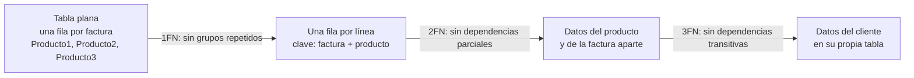
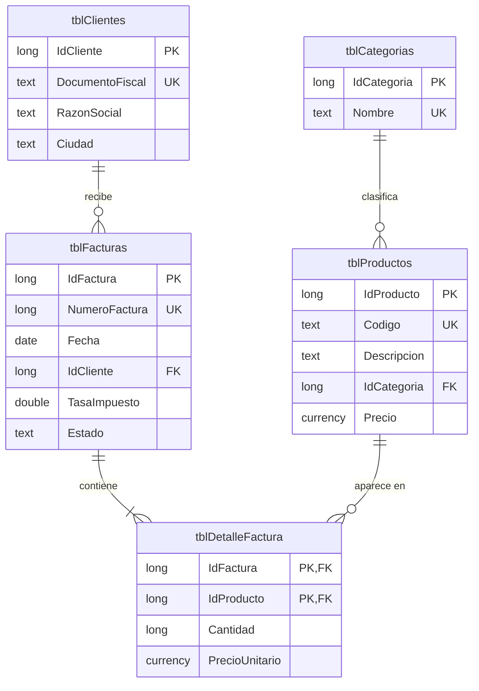

# Laboratorio 3 · Normalización y relaciones

Hoy partes de facturas guardadas en una sola tabla plana, descubres sus problemas y las divides en tablas relacionadas que Access protege con integridad referencial.

## Objetivos

- Detectar redundancia y anomalías de actualización, inserción y borrado.
- Aplicar la primera, segunda y tercera formas normales.
- Implementar relaciones uno a muchos con integridad referencial.
- Resolver una relación muchos a muchos con una tabla intermedia.
- Explicar la clave foránea como una referencia entre registros.

## Conceptos

**Redundancia y anomalías.** Una tabla plana repite datos: el nombre del cliente aparece en cada una de sus facturas. Esa repetición produce tres anomalías.

| Anomalía | Qué pasa en `factura_plana.csv` |
| --- | --- |
| Actualización | Si el cliente cambia de dirección hay que corregir todas sus filas; si olvidas una, los datos se contradicen |
| Inserción | No puedes registrar un cliente nuevo hasta que compre algo |
| Borrado | Si borras la única factura de un cliente, pierdes también al cliente |

**Formas normales.** Son tres reglas que eliminan la redundancia paso a paso.

- **Primera forma normal (1FN):** cada celda guarda un solo valor y no hay grupos repetidos como Producto1, Producto2 y Producto3.
- **Segunda forma normal (2FN):** cada atributo depende de la clave completa. En una línea con clave (factura, producto), la descripción depende solo del producto.
- **Tercera forma normal (3FN):** ningún atributo depende de otro que no sea clave. La ciudad depende del cliente, no de la factura.

**No toda repetición es redundancia.** El precio unitario se guarda en cada línea aunque también esté en `tblProductos`. Es el precio histórico de esa venta: si mañana cambia el precio del producto, las facturas viejas no deben cambiar.

**La clave foránea es una referencia.** `IdCliente` en `tblFacturas` guarda el valor de la clave de un cliente: es un puntero, pero por valor. La integridad referencial impide referencias colgantes, es decir, facturas que apuntan a clientes que no existen.

> **Conexión:** una referencia colgante en una base de datos equivale a un puntero colgante (dangling pointer) en C.

**Muchos a muchos.** Una factura tiene muchos productos y un producto aparece en muchas facturas. La relación se resuelve con `tblDetalleFactura`, una tabla intermedia cuya clave combina las dos referencias y que además guarda cantidad y precio.

**Composición.** Las líneas no existen sin su factura. Por eso la relación entre facturas y detalle usa eliminación en cascada; las demás relaciones no la usan.

Este es el modelo al que llegarás hoy:

**El orden de carga es un orden topológico.** El diagrama de relaciones es un grafo dirigido del padre al hijo. Para cargar datos sin violar la integridad, primero van los padres (categorías y clientes), luego productos y facturas, y al final el detalle.

## Paso a paso

### Parte A · Analiza la tabla plana (20 min)

1. Abre `C:\CursoED\datos\factura_plana.csv` con el Bloc de notas o con Excel.
2. Marca los grupos repetidos y los datos del cliente que se repiten.
3. Compara las filas de las facturas 1001 y 1004: tienen el mismo documento fiscal, pero la razón social y la ciudad están escritas distinto.
4. Responde: ¿qué harías si una factura tuviera cuatro productos?

### Parte B · Normaliza en papel (20 min)

1. Aplica 1FN: reescribe la tabla con una fila por línea. La clave es (número de factura, producto).
2. Aplica 2FN: separa lo que depende solo de la factura (fecha, cliente) y lo que depende solo del producto (descripción).
3. Aplica 3FN: separa los datos del cliente.
4. Elimina la columna Total: se calcula.
5. Compara tu resultado con el diagrama de la sección Conceptos.

### Parte C · Crea las tablas nuevas (30 min)

1. Crea `tblCategorias`:

| Campo | Tipo | Propiedades |
| --- | --- | --- |
| `IdCategoria` | Número, Entero largo | Clave principal |
| `Nombre` | Texto corto | Tamaño 50 · Requerido: Sí · Indexado: Sí (Sin duplicados) |

2. Importa `categorias.csv` en `tblCategorias` con los mismos ajustes avanzados del laboratorio 2.
3. Crea `tblFacturas`:

| Campo | Tipo | Propiedades |
| --- | --- | --- |
| `IdFactura` | Autonumeración | Clave principal |
| `NumeroFactura` | Número, Entero largo | Indexado: Sí (Sin duplicados). Queda vacío mientras la factura es borrador |
| `Fecha` | Fecha/Hora | Requerido: Sí · Valor predeterminado: `Date()` |
| `IdCliente` | Número, Entero largo | Requerido: Sí |
| `TasaImpuesto` | Número, Doble | Formato: Porcentaje · Regla de validación: `Between 0 And 1` |
| `Estado` | Texto corto | Tamaño 10 · Requerido: Sí · Valor predeterminado: `"Borrador"` · Regla de validación: `"Borrador" Or "Emitida" Or "Pagada" Or "Anulada"` |
| `Observaciones` | Texto largo | Sin propiedades especiales |

4. Crea `tblDetalleFactura`. Para la clave compuesta, selecciona las filas `IdFactura` e `IdProducto` con Ctrl presionado y pulsa Clave principal.

| Campo | Tipo | Propiedades |
| --- | --- | --- |
| `IdFactura` | Número, Entero largo | Parte de la clave principal |
| `IdProducto` | Número, Entero largo | Parte de la clave principal |
| `Cantidad` | Número, Entero largo | Requerido: Sí · Valor predeterminado: 1 · Regla de validación: `>0` |
| `PrecioUnitario` | Moneda | Requerido: Sí · Regla de validación: `>=0` |

> **Ojo · Access en español:** si Access rechaza las reglas en inglés, escríbelas así: `Entre 0 Y 1` y `"Borrador" O "Emitida" O "Pagada" O "Anulada"`.

### Parte D · Crea las relaciones (25 min)

1. Elige Herramientas de base de datos → Relaciones (Database Tools → Relationships) y agrega las cinco tablas.
2. Arrastra `IdCliente` de `tblClientes` sobre `IdCliente` de `tblFacturas`. Marca Exigir integridad referencial (Enforce Referential Integrity) y pulsa Crear.
3. Une `tblFacturas.IdFactura` con `tblDetalleFactura.IdFactura`. Marca la integridad y también Eliminar en cascada los registros relacionados (Cascade Delete Related Records).
4. Une `tblProductos.IdProducto` con `tblDetalleFactura.IdProducto`, solo con integridad.
5. Une `tblCategorias.IdCategoria` con `tblProductos.IdCategoria`, solo con integridad.
6. Guarda el diseño de relaciones. Cada línea debe mostrar 1 en el lado padre y ∞ en el lado hijo.

> **Captura sugerida:** la ventana Relaciones con las cinco tablas y sus cuatro líneas.

> **Ojo:** si Access no deja crear una relación, revisa que ambos campos sean Entero largo y que ningún registro hijo apunte a un padre inexistente.

### Parte E · Carga en orden topológico (15 min)

1. Intenta importar primero `detalle_factura.csv` en `tblDetalleFactura`. Access no anexa las líneas: sus facturas todavía no existen.
2. Importa `facturas.csv` en `tblFacturas` y después `detalle_factura.csv` en `tblDetalleFactura`.

### Parte F · Prueba la integridad (10 min)

1. En `tblDetalleFactura`, intenta agregar una línea de la factura 1 con el producto 99.
2. En `tblClientes`, intenta borrar el cliente 1.
3. Crea una factura de prueba para el cliente 5 con una línea y después borra la factura. Su línea desaparece con ella.
4. Haz la copia de seguridad de la base.

## Puntos de control

- [ ] Hay 11 categorías, 7 facturas y 16 líneas de detalle.
- [ ] La ventana Relaciones muestra 4 relaciones, cada una con 1 e ∞.
- [ ] Access rechaza una línea con un producto inexistente y el borrado de un cliente con facturas.
- [ ] Al borrar la factura de prueba se borra también su línea.

## Tarea 3 · Normaliza una tabla de pedidos

La empresa guarda sus pedidos a proveedores en esta tabla plana:

| NumPedido | Fecha | Proveedor | TelProveedor | Producto1 | Cant1 | Costo1 | Producto2 | Cant2 | Costo2 |
| --- | --- | --- | --- | --- | --- | --- | --- | --- | --- |
| P-01 | 2026-09-02 | Suministros Lema | 555-0201 | Resma de papel carta | 50 | 95.00 | Bolígrafo azul (caja 12) | 20 | 55.00 |
| P-02 | 2026-09-09 | Suministros Lema | 555-0299 | Cable HDMI 2 m | 30 | 110.00 | | | |
| P-03 | 2026-09-12 | Tecnodistribución | 555-0310 | Monitor 24 pulgadas | 5 | 2200.00 | Teclado inalámbrico | 5 | 360.00 |

1. Señala un ejemplo de cada anomalía en esta tabla.
2. Normalízala hasta 3FN y dibuja el modelo en Mermaid con claves y cardinalidades.
3. Crea las tablas en Access, reutilizando la `tblProveedores` de la tarea 2, con sus relaciones.
4. Indica qué relación llevaría eliminación en cascada y por qué.

## Autoevaluación

1. ¿Qué anomalía aparece si guardas la dirección del cliente en cada factura?
2. ¿Por qué `PrecioUnitario` va en `tblDetalleFactura` aunque exista `tblProductos.Precio`?
3. ¿Por qué la cascada va entre facturas y detalle, y no entre clientes y facturas?
4. ¿En qué orden cargarías categorías, detalle, clientes, productos y facturas?
