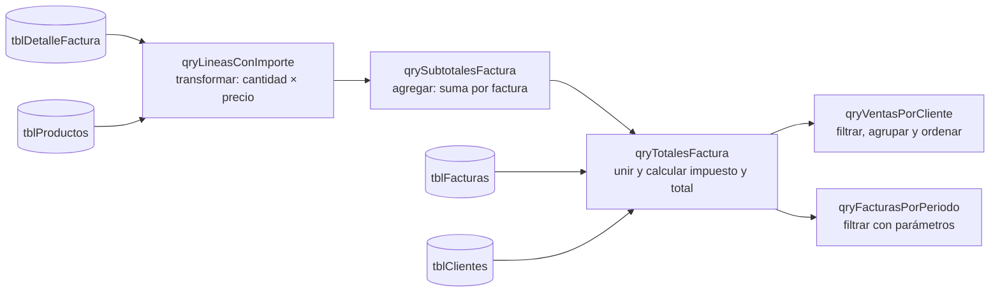

# Laboratorio 4 · Consultas: operar sobre colecciones

Hoy calculas importes, subtotales, impuestos y totales con consultas. Descubrirás que cada consulta es una operación clásica sobre colecciones: filtrar, transformar, agregar, unir u ordenar.

## Objetivos

- Relacionar las operaciones sobre colecciones con las partes de una consulta.
- Crear consultas con campos calculados, criterios, orden y parámetros.
- Calcular el total de cada factura encadenando consultas.
- Leer y escribir SQL de Access.
- Guardar la configuración del sistema en una tabla de un solo registro.

## Conceptos

**Operaciones sobre colecciones.** Todo lo que harás hoy es una combinación de seis operaciones que ya conoces de programación.

| Operación | En SQL | En programación | Ejemplo en el sistema |
| --- | --- | --- | --- |
| Filtrar | `WHERE` | `filter` | Facturas emitidas o pagadas |
| Proyectar | Lista del `SELECT` | Elegir campos | Solo número y total |
| Transformar | Campo calculado | `map` | Importe = cantidad × precio |
| Agregar | `GROUP BY` con `Sum` o `Count` | `reduce` | Subtotal por factura |
| Unir | `JOIN` | Seguir referencias | Factura con su cliente |
| Ordenar | `ORDER BY` | `sort` | Clientes por monto vendido |

> **Conexión:** una consulta describe qué resultado quieres, no cómo obtenerlo. El motor de Access decide si recorre la tabla o usa un índice. A ese estilo se le llama programación declarativa.

**Encadenar consultas.** Una consulta puede usar otra como si fuera una tabla. Así el total se arma como una tubería: cada paso hace una sola cosa y se prueba por separado.



**Configuración en una tabla.** La tasa de impuesto no se escribe dentro de las fórmulas: vive en `tblParametros`, una tabla de un solo registro. Su regla de validación `=1` sobre la clave impide agregar un segundo registro.

**SQL siempre en inglés.** En la vista SQL, las funciones y palabras clave están en inglés aunque tu Access esté en español. Por eso los cálculos de este laboratorio se escriben ahí.

> **Ojo:** `Round` redondea al par más cercano cuando el valor está justo a la mitad: `Round(2.5)` da 2 y `Round(3.5)` da 4. Se llama redondeo bancario y conviene saberlo al revisar centavos.

## Paso a paso

### Parte A · La tabla de parámetros (10 min)

1. Crea `tblParametros`:

| Campo | Tipo | Propiedades |
| --- | --- | --- |
| `Id` | Número, Entero largo | Clave principal · Regla de validación: `=1` |
| `NombreEmpresa` | Texto corto | Tamaño 100 |
| `DocumentoFiscalEmpresa` | Texto corto | Tamaño 20 |
| `TasaImpuesto` | Número, Doble | Formato: Porcentaje · Regla de validación: `Between 0 And 1` |

2. Agrega el registro: 1, Distribuidora Aula, 0011223344 y 16 % (escribe `16%`).
3. Intenta agregar un segundo registro con Id 2. Access debe rechazarlo.

La tasa del 16 % es un ejemplo: usa la de tu país. Las facturas de ejemplo guardan su propia tasa, así que sus totales no cambian.

### Parte B · Transformar: el importe de cada línea (15 min)

1. Elige Crear → Diseño de consulta (Query Design) y agrega `tblDetalleFactura` y `tblProductos`. La línea de unión aparece sola porque existe la relación.
2. Agrega `IdFactura`, `IdProducto`, `Cantidad` y `PrecioUnitario` de `tblDetalleFactura`, y `Codigo` y `Descripcion` de `tblProductos`.
3. En una columna vacía escribe `Importe: [Cantidad]*[PrecioUnitario]` y ejecuta la consulta: debe mostrar 16 filas.
4. Cambia a Vista SQL. Access escribe los nombres completos de las tablas; esta versión equivalente usa alias cortos:

```sql
SELECT d.IdFactura, d.IdProducto, p.Codigo, p.Descripcion,
       d.Cantidad, d.PrecioUnitario,
       d.Cantidad * d.PrecioUnitario AS Importe
FROM tblDetalleFactura AS d
     INNER JOIN tblProductos AS p ON d.IdProducto = p.IdProducto;
```

5. Guarda la consulta como `qryLineasConImporte`.

### Parte C · Agregar: el subtotal por factura (15 min)

1. Crea una consulta nueva, cierra la ventana de tablas y cambia a Vista SQL.
2. Escribe y ejecuta:

```sql
SELECT IdFactura, Sum(Importe) AS Subtotal
FROM qryLineasConImporte
GROUP BY IdFactura;
```

3. Guarda como `qrySubtotalesFactura`. Cambia a vista Diseño y observa la fila Total con Agrupar por y Suma.

### Parte D · Unir: el total de cada factura (20 min)

```sql
SELECT f.IdFactura, f.NumeroFactura, f.Fecha, f.Estado, c.RazonSocial,
       s.Subtotal, f.TasaImpuesto,
       CCur(Round(s.Subtotal * f.TasaImpuesto, 2)) AS Impuesto,
       s.Subtotal + CCur(Round(s.Subtotal * f.TasaImpuesto, 2)) AS Total
FROM (tblClientes AS c
      INNER JOIN tblFacturas AS f ON c.IdCliente = f.IdCliente)
      INNER JOIN qrySubtotalesFactura AS s ON f.IdFactura = s.IdFactura;
```

Guarda como `qryTotalesFactura` y compara con los puntos de control.

> **Ojo:** Access exige paréntesis cuando unes más de dos tablas o consultas en el `FROM`.

### Parte E · Filtrar, agrupar y ordenar: ventas por cliente (15 min)

```sql
SELECT RazonSocial, Count(*) AS Facturas, Sum(Total) AS TotalVendido
FROM qryTotalesFactura
WHERE Estado IN ('Emitida', 'Pagada')
GROUP BY RazonSocial
ORDER BY Sum(Total) DESC;
```

Guarda como `qryVentasPorCliente`.

### Parte F · Parámetros: facturas de un periodo (15 min)

```sql
PARAMETERS [Fecha inicial] DateTime, [Fecha final] DateTime;
SELECT NumeroFactura, Fecha, RazonSocial, Total
FROM qryTotalesFactura
WHERE Fecha BETWEEN [Fecha inicial] AND [Fecha final]
ORDER BY Fecha;
```

1. Guarda como `qryFacturasPorPeriodo` y ejecútala.
2. Escribe las fechas 1 y 10 de septiembre de 2026 en el formato de tu configuración regional.
3. Haz la copia de seguridad de la base.

## Puntos de control

`qryTotalesFactura` debe mostrar estos valores:

| Factura | Estado | Cliente | Subtotal | Impuesto | Total |
| --- | --- | --- | --- | --- | --- |
| 1001 | Pagada | Papelería El Estudiante, S.A. | 1,844.00 | 295.04 | 2,139.04 |
| 1002 | Emitida | Escuela Técnica Horizonte | 33,375.00 | 5,340.00 | 38,715.00 |
| 1003 | Emitida | Consultores Andinos, S.R.L. | 9,146.70 | 1,463.47 | 10,610.17 |
| 1004 | Pagada | Papelería El Estudiante, S.A. | 1,495.00 | 239.20 | 1,734.20 |
| 1005 | Emitida | Clínica Dental Sonrisas | 3,954.80 | 632.77 | 4,587.57 |
| 1006 | Anulada | Juan Carlos Méndez | 11,499.00 | 1,839.84 | 13,338.84 |
| Sin número | Borrador | Talleres Mecánicos Rodríguez | 14,348.00 | 2,295.68 | 16,643.68 |

- [ ] `qryTotalesFactura` coincide con la tabla anterior.
- [ ] `qryVentasPorCliente` muestra 4 clientes: primero Escuela Técnica Horizonte (38,715.00) y Papelería El Estudiante con 2 facturas y 3,873.24.
- [ ] `qryFacturasPorPeriodo` del 1 al 10 de septiembre devuelve las facturas 1001 a 1004.
- [ ] `tblParametros` rechaza un segundo registro.

## Tarea 4 · Ventas por producto y por mes

1. Crea `qryVentasPorProducto`: unidades y monto vendido por producto, solo de facturas emitidas o pagadas, de mayor a menor monto.
2. Crea `qryVentasPorMes`: total facturado por año y mes. Pista: `Year(Fecha)` y `Month(Fecha)` en el `GROUP BY`.
3. Para cada consulta, indica qué operaciones de colecciones usa.
4. Reto: modifica una copia de `qryTotalesFactura` para que las facturas sin líneas aparezcan con total 0. Pista: `LEFT JOIN` y `Nz`.

## Autoevaluación

1. ¿Qué operación de colecciones hace `GROUP BY` con `Sum`?
2. ¿Por qué conviene dividir el cálculo del total en tres consultas?
3. ¿Qué pasaría si la tasa estuviera escrita como 0.16 dentro de la consulta y el impuesto cambiara?
4. ¿Por qué una factura sin líneas no aparece en `qryTotalesFactura`?
