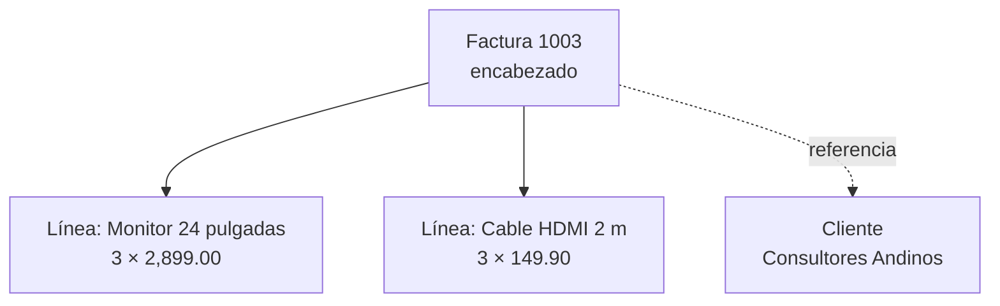

# Laboratorio 5 · Maestro-detalle e informe

Hoy construyes el formulario para capturar facturas con sus líneas y la factura imprimible. Ambos reflejan la misma estructura: un padre con sus hijos.

## Objetivos

- Explicar la factura como una jerarquía padre-hijo y reflejarla en un formulario con subformulario.
- Usar cuadros combinados que muestran un nombre y guardan una clave.
- Escribir procedimientos de evento en VBA para copiar el precio y calcular totales.
- Crear un informe agrupado por factura e imprimir solo la factura actual.

## Conceptos

**Jerarquía padre-hijo.** Una factura es un árbol de profundidad 1: la raíz es el encabezado y las hojas son sus líneas. El formulario principal muestra el padre, y el subformulario, solo los hijos del padre actual, vinculados por `IdFactura`.



**El cuadro combinado resuelve referencias.** La factura guarda `IdCliente`, pero nadie recuerda que Consultores Andinos es el cliente 2. El cuadro combinado muestra la razón social y guarda la clave: su primera columna, oculta con ancho 0 cm, es el valor.

> **Conexión:** la lista de un cuadro combinado es un pequeño arreglo en memoria. `Column(2)` lee la tercera columna de la fila elegida, porque el índice empieza en 0.

**Programación por eventos.** Access ejecuta tu código cuando algo ocurre: el usuario elige un producto, empieza un registro nuevo o cambia de registro. Cada evento tiene un procedimiento con nombre fijo, como `IdProducto_AfterUpdate`.

**Informe agrupado.** Un informe agrupado recorre la jerarquía en orden: primero el encabezado del grupo, después cada línea y al final el pie con los totales.

| Sección del informe | Qué imprime | Momento del recorrido |
| --- | --- | --- |
| Encabezado del grupo `IdFactura` | Empresa emisora, número, fecha y cliente | Al entrar al nodo padre |
| Detalle | Una fila por línea | En cada hijo |
| Pie del grupo `IdFactura` | Subtotal, impuesto y total | Al salir del nodo padre |

## Paso a paso

### Parte A · Formulario con subformulario (25 min)

1. Elige Crear → Asistente para formularios (Form Wizard).
2. Elige `tblFacturas` y agrega todos sus campos. Después elige `tblDetalleFactura` y agrega `IdProducto`, `Cantidad` y `PrecioUnitario`.
3. Ver los datos por `tblFacturas`, como Formulario con subformularios (Form with subform).
4. Nombra los formularios `frmFacturas` y `sfrmDetalleFactura` y finaliza.
5. Abre `frmFacturas` en vista Diseño y amplía el subformulario para ver varias líneas.

> **Captura sugerida:** `frmFacturas` en vista Formulario mostrando la factura 1003 y sus dos líneas.

### Parte B · Cuadros combinados (20 min)

1. En `frmFacturas`, haz clic derecho sobre `IdCliente` y elige Cambiar a → Cuadro combinado (Change To → Combo Box).
2. Abre la Hoja de propiedades con F4. En Origen de la fila (Row Source) escribe:

```sql
SELECT IdCliente, RazonSocial FROM tblClientes ORDER BY RazonSocial;
```

3. Ajusta: Columna dependiente 1, Limitar a la lista Sí, Número de columnas 2 y Ancho de columnas `0cm;6cm`.
4. Cambia `Estado` a cuadro combinado con Tipo de origen de la fila: Lista de valores y Origen de la fila: `Borrador;Emitida;Pagada;Anulada`.
5. En `sfrmDetalleFactura`, cambia `IdProducto` a cuadro combinado con Número de columnas 3, Ancho de columnas `0cm;6cm;2cm` y este origen:

```sql
SELECT IdProducto, Descripcion, Precio FROM tblProductos
WHERE Activo = True ORDER BY Descripcion;
```

6. Agrega al subformulario un cuadro de texto `txtImporte` con Origen del control `=[Cantidad]*[PrecioUnitario]` y formato Moneda.

### Parte C · Código de eventos (30 min)

Para crear un procedimiento de evento, selecciona el control o el formulario, abre la pestaña Evento de la Hoja de propiedades, elige [Procedimiento de evento] y pulsa el botón de los tres puntos.

1. En `sfrmDetalleFactura`, evento Después de actualizar (After Update) de `IdProducto`: copia el precio vigente.

```vb
Private Sub IdProducto_AfterUpdate()
    ' Column(2) es la tercera columna del combo: el precio vigente
    Me.PrecioUnitario = Me.IdProducto.Column(2)
End Sub
```

2. En `frmFacturas`, evento Antes de insertar (Before Insert): toma la tasa de los parámetros.

```vb
Private Sub Form_BeforeInsert(Cancel As Integer)
    Me.TasaImpuesto = DLookup("TasaImpuesto", "tblParametros", "Id = 1")
End Sub
```

3. En `frmFacturas`, agrega tres cuadros de texto independientes con formato Moneda: `txtSubtotal`, `txtImpuesto` y `txtTotal`. Agrega este código:

```vb
Public Sub ActualizarTotales()
    Dim subtotal As Currency, impuesto As Currency
    If Not Me.NewRecord Then
        subtotal = Nz(DSum("Cantidad * PrecioUnitario", "tblDetalleFactura", _
                           "IdFactura = " & Me.IdFactura), 0)
    End If
    impuesto = CCur(Round(subtotal * Nz(Me.TasaImpuesto, 0), 2))
    Me.txtSubtotal = subtotal
    Me.txtImpuesto = impuesto
    Me.txtTotal = subtotal + impuesto
End Sub

Private Sub Form_Current()
    ActualizarTotales
End Sub
```

4. En `sfrmDetalleFactura`, recalcula cuando cambian las líneas:

```vb
Private Sub Form_AfterUpdate()
    Me.Parent.ActualizarTotales
End Sub

Private Sub Form_AfterDelConfirm(Status As Integer)
    Me.Parent.ActualizarTotales
End Sub
```

> **Concepto:** `Me` es el formulario donde está el código y `Me.Parent` es el formulario principal. Es tu primer contacto con objetos: el formulario tiene propiedades, como `NewRecord`, y métodos, como `ActualizarTotales`.

> **Ojo:** el código VBA no se traduce. `DLookup` y `DSum` se escriben en inglés aunque tu Access esté en español.

### Parte D · El informe de la factura (25 min)

1. Crea en Vista SQL la consulta `qryFacturaImpresion`:

```sql
SELECT p.NombreEmpresa, p.DocumentoFiscalEmpresa,
       t.IdFactura, t.NumeroFactura, t.Fecha, t.Estado, t.RazonSocial,
       c.DocumentoFiscal, c.Direccion, c.Ciudad,
       l.Codigo, l.Descripcion, l.Cantidad, l.PrecioUnitario, l.Importe,
       t.Subtotal, t.TasaImpuesto, t.Impuesto, t.Total
FROM tblParametros AS p,
     ((qryTotalesFactura AS t
       INNER JOIN tblFacturas AS f ON t.IdFactura = f.IdFactura)
       INNER JOIN tblClientes AS c ON f.IdCliente = c.IdCliente)
       INNER JOIN qryLineasConImporte AS l ON t.IdFactura = l.IdFactura;
```

> **Concepto:** `tblParametros` entra en el `FROM` separada por una coma y sin `ON`. Una unión sin condición combina cada fila de un lado con cada fila del otro: es un producto cartesiano. Como `tblParametros` tiene un solo registro, cada línea recibe los datos de la empresa una sola vez, y el encabezado de cada factura los imprime. Si la tabla tuviera dos registros, cada línea saldría dos veces; si no tuviera ninguno, el informe saldría vacío. Ahí trabaja la regla `=1` del laboratorio 4.

2. Elige Crear → Asistente para informes (Report Wizard) sobre `qryFacturaImpresion` y agrega todos los campos.
3. Agrupa por `IdFactura`, ordena el detalle por `Descripcion`, elige la distribución En pasos y nombra el informe `rptFactura`.
4. En vista Diseño, abre el panel Agrupación, orden y total (Group, Sort, and Total), pulsa Más y activa la sección de pie del grupo.
5. Mueve al encabezado del grupo los datos de la empresa (`NombreEmpresa` y `DocumentoFiscalEmpresa`), de la factura y del cliente, y `Subtotal`, `Impuesto` y `Total` al pie del grupo.
6. En la propiedad Forzar nueva página (Force New Page) del pie del grupo elige Después de la sección.

> **Captura sugerida:** la vista preliminar de `rptFactura` con la factura 1003.

### Parte E · Imprimir la factura actual (10 min)

Agrega a `frmFacturas` un botón `cmdImprimir` (cancela el asistente) con este evento Al hacer clic (On Click):

```vb
Private Sub cmdImprimir_Click()
    If Me.Dirty Then Me.Dirty = False     ' guarda antes de imprimir
    DoCmd.OpenReport "rptFactura", acViewPreview, , "IdFactura = " & Me.IdFactura
End Sub
```

### Parte F · Observa lo que el sistema todavía permite (10 min)

1. Abre la factura 1001, que está pagada, y cambia la cantidad de su primera línea de 10 a 11. Access lo permite.
2. Crea una factura nueva con estado Emitida, sin líneas y sin número. Access también lo permite.
3. Anota estas reglas rotas: las resolverás en las sesiones 7 y 8.
4. Vuelve la cantidad a 10, borra la factura de prueba y haz la copia de seguridad.

## Puntos de control

- [ ] `frmFacturas` muestra la factura 1003 con 2 líneas y totales 9,146.70, 1,463.47 y 10,610.17.
- [ ] Al elegir un producto en una línea nueva, el precio se copia solo.
- [ ] Una factura nueva toma la tasa de `tblParametros`.
- [ ] `rptFactura` muestra una factura por página y `cmdImprimir` muestra solo la factura actual.
- [ ] El encabezado de cada factura en `rptFactura` muestra el nombre y el documento fiscal de la empresa.

## Tarea 5 · Estado de cuenta por cliente

1. Crea `rptEstadoCuenta`: agrupado por cliente, con sus facturas emitidas y pagadas (fecha, número, estado y total) y el total por cliente.
2. Dibuja en Mermaid el árbol de secciones de tu informe.
3. Describe dos reglas del negocio que el formulario todavía deja romper y propón dónde debería vivir cada una.

## Autoevaluación

1. ¿Qué campo vincula el formulario principal con el subformulario y por qué?
2. ¿Qué guarda y qué muestra un cuadro combinado con ancho de columnas `0cm;6cm`?
3. ¿Por qué el precio se copia a la línea en vez de consultarse siempre en `tblProductos`?
4. ¿En qué orden recorre un informe agrupado las secciones de una factura?
