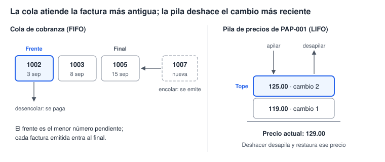
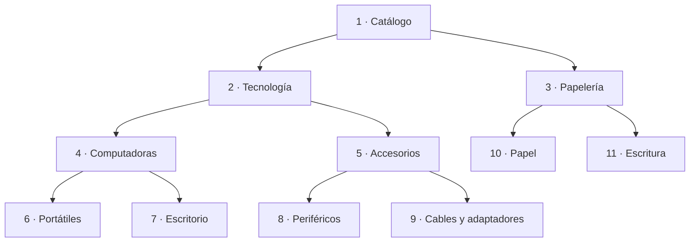

# Laboratorio 6 · Cola, pila, árbol y diccionario

Hoy reconoces cuatro estructuras clásicas dentro del sistema de facturación y las implementas con tablas, consultas y VBA.

## Objetivos

- Definir un tipo abstracto de datos (TAD) como datos más sus operaciones permitidas.
- Implementar una cola de cobranza (FIFO) y atender su frente.
- Implementar una pila de cambios de precio (LIFO) que permite deshacer.
- Modelar las categorías como un árbol con una relación reflexiva y recorrerlo con recursión.
- Usar un diccionario en memoria para acumular valores por clave.

## Conceptos

**Tipo abstracto de datos.** Un TAD define qué operaciones se permiten sobre los datos, no cómo se guardan. Una cola y una pila pueden guardar los mismos registros: lo que cambia es la regla de acceso.

| Estructura | Disciplina de acceso | Operaciones | En el sistema |
| --- | --- | --- | --- |
| Cola | FIFO: el primero en entrar es el primero en salir | Encolar, desencolar, ver el frente | Facturas emitidas pendientes de cobro |
| Pila | LIFO: el último en entrar es el primero en salir | Apilar, desapilar, ver el tope | Cambios de precio que se pueden deshacer |
| Árbol | Jerarquía: cada nodo tiene un padre, salvo la raíz | Hijos, padre, recorrer | Categorías de productos |
| Diccionario | Acceso directo por clave | Agregar, existe, obtener | Unidades vendidas por producto |



**Cola de cobranza.** Una factura entra a la cola cuando se emite y sale cuando se paga. El número de factura se asigna en orden de emisión, así que funciona como el turno en una fila: el frente es el menor número pendiente.

**Pila de precios.** Antes de cambiar un precio, el sistema apila el precio anterior en `tblHistorialPrecios`. Deshacer desapila el cambio más reciente y restaura ese precio. El autonumérico `IdCambio` marca el orden de llegada, así que el tope es el mayor `IdCambio`.

> **Ojo:** `TOP 1` en Access devuelve todas las filas empatadas. Ordena siempre por un campo único, como `IdCambio` o `NumeroFactura`, para obtener exactamente una.

**Árbol de categorías.** Cada categoría guarda el Id de su padre en `IdCategoriaPadre`, y la raíz lo deja vacío. Es una relación reflexiva: la tabla se relaciona consigo misma.



El SQL de Access no tiene consultas recursivas, así que el árbol se recorre con un procedimiento VBA recursivo: visita el nodo y después a cada uno de sus hijos (recorrido en preorden).

> **Conexión:** el recorrido en preorden es el que usa el Explorador de archivos para mostrar carpetas y subcarpetas.

**Diccionario.** Un diccionario guarda pares clave → valor y encuentra una clave en tiempo casi constante, sin recorrer todo. Por dentro usa una tabla hash. VBA lo ofrece como `Scripting.Dictionary`.

## Paso a paso

### Parte A · Prepara el código (5 min)

Importa `vba\modEstructuras.bas` y compila (ver «Cómo importar un módulo de código» en `00_inicio.md`).

### Parte B · La cola de cobranza (20 min)

1. Crea la consulta `qryColaCobranza`:

```sql
SELECT NumeroFactura, Fecha, RazonSocial, Total
FROM qryTotalesFactura
WHERE Estado = 'Emitida'
ORDER BY NumeroFactura;
```

2. Ábrela: la cola tiene las facturas 1002, 1003 y 1005, con 1002 al frente.
3. En la ventana Inmediato escribe `? AtenderSiguienteCobro()`. Debe responder 1002.
4. Vuelve a abrir `qryColaCobranza`: ahora el frente es 1003.

```vb
Public Function AtenderSiguienteCobro() As Long
    Dim db As DAO.Database, rs As DAO.Recordset
    Set db = CurrentDb
    Set rs = db.OpenRecordset( _
        "SELECT TOP 1 IdFactura, NumeroFactura FROM tblFacturas " & _
        "WHERE Estado = 'Emitida' ORDER BY NumeroFactura", dbOpenSnapshot)
    If Not rs.EOF Then                        ' la cola no está vacía
        db.Execute "UPDATE tblFacturas SET Estado = 'Pagada' " & _
                   "WHERE IdFactura = " & rs!IdFactura, dbFailOnError
        AtenderSiguienteCobro = rs!NumeroFactura
    End If
    rs.Close
End Function
```

### Parte C · La pila de cambios de precio (25 min)

1. Crea `tblHistorialPrecios` y relaciónala con `tblProductos` exigiendo integridad:

| Campo | Tipo | Propiedades |
| --- | --- | --- |
| `IdCambio` | Autonumeración | Clave principal |
| `IdProducto` | Número, Entero largo | Requerido: Sí |
| `PrecioAnterior` | Moneda | Requerido: Sí |
| `FechaCambio` | Fecha/Hora | Valor predeterminado: `Now()` |

2. En la ventana Inmediato ejecuta `CambiarPrecio 11, 125` y después `CambiarPrecio 11, 129`. PAP-001 queda en 129.00 y la pila tiene 2 registros.
3. Ejecuta `? DeshacerUltimoCambio(11)` dos veces. El precio vuelve a 125.00 y luego a 119.00.
4. Ejecútalo una tercera vez: responde Falso porque la pila está vacía.
5. Abre `qryLineasConImporte`: las facturas 1001, 1004 y 1005 conservan 119.00. Así funciona el precio histórico.

```vb
Public Function DeshacerUltimoCambio(ByVal idProducto As Long) As Boolean
    Dim db As DAO.Database, rs As DAO.Recordset
    Set db = CurrentDb
    ' el tope de la pila es el cambio más reciente del producto
    Set rs = db.OpenRecordset( _
        "SELECT TOP 1 IdCambio, PrecioAnterior FROM tblHistorialPrecios " & _
        "WHERE IdProducto = " & idProducto & " ORDER BY IdCambio DESC", dbOpenSnapshot)
    If rs.EOF Then
        rs.Close
        Exit Function                       ' pila vacía: devuelve False
    End If
    ActualizarPrecio idProducto, rs!PrecioAnterior
    db.Execute "DELETE FROM tblHistorialPrecios WHERE IdCambio = " & rs!IdCambio, dbFailOnError
    rs.Close
    DeshacerUltimoCambio = True
End Function
```

> **Concepto:** `ActualizarPrecio` usa una consulta con parámetros en vez de pegar el precio dentro del texto SQL. Así evita errores con la coma decimal y ataques de inyección SQL.

### Parte D · El árbol de categorías (30 min)

1. En `tblCategorias` agrega el campo `IdCategoriaPadre`: Número, Entero largo, no requerido.
2. En vista Hoja de datos, llena `IdCategoriaPadre` según el diagrama: 1 queda vacío; 2 y 3 tienen padre 1; 4 y 5, padre 2; 6 y 7, padre 4; 8 y 9, padre 5; 10 y 11, padre 3.
3. En la ventana Relaciones agrega `tblCategorias` por segunda vez (Access la llama `tblCategorias_1`). Arrastra `IdCategoria` de `tblCategorias` sobre `IdCategoriaPadre` de `tblCategorias_1` y exige integridad.
4. En la ventana Inmediato ejecuta `ImprimirArbol`. Debes ver:

```text
- Catálogo
    - Papelería
        - Escritura
        - Papel
    - Tecnología
        - Accesorios
            - Cables y adaptadores
            - Periféricos
        - Computadoras
            - Escritorio
            - Portátiles
```

```vb
Public Sub ImprimirArbol(Optional ByVal idPadre As Long = 0, _
                         Optional ByVal nivel As Integer = 0)
    Dim rs As DAO.Recordset, filtro As String
    If idPadre = 0 Then
        filtro = "IdCategoriaPadre Is Null"           ' la raíz no tiene padre
    Else
        filtro = "IdCategoriaPadre = " & idPadre
    End If
    Set rs = CurrentDb.OpenRecordset("SELECT IdCategoria, Nombre FROM tblCategorias " & _
                                     "WHERE " & filtro & " ORDER BY Nombre", dbOpenSnapshot)
    Do Until rs.EOF
        Debug.Print String(nivel * 4, " ") & "- " & rs!Nombre   ' visita el nodo...
        ImprimirArbol rs!IdCategoria, nivel + 1                 ' ...y luego a sus hijos
        rs.MoveNext
    Loop
    rs.Close
End Sub
```

5. Crea `qryCategoriasHoja`, las categorías sin hijos. Debe devolver 6.

```sql
SELECT c.IdCategoria, c.Nombre
FROM tblCategorias AS c
     LEFT JOIN tblCategorias AS h ON c.IdCategoria = h.IdCategoriaPadre
WHERE h.IdCategoria IS NULL;
```

6. Crea `qryProductosConPadre`, que sube un nivel con otra unión reflexiva:

```sql
SELECT p.Codigo, p.Descripcion, m.Nombre & " > " & c.Nombre AS Ruta
FROM (tblProductos AS p
      INNER JOIN tblCategorias AS c ON p.IdCategoria = c.IdCategoria)
      LEFT JOIN tblCategorias AS m ON c.IdCategoriaPadre = m.IdCategoria;
```

Cada unión reflexiva sube un nivel. Como las ramas tienen profundidades distintas, ninguna cantidad fija de uniones sirve para todas: por eso existe la recursión.

### Parte E · El diccionario (15 min)

1. En la ventana Inmediato ejecuta `UnidadesPorProducto`. Muestra cada código con las unidades vendidas.
2. Compara con esta consulta. El resultado es el mismo, aunque el orden puede cambiar:

```sql
SELECT p.Codigo, Sum(d.Cantidad) AS Unidades
FROM tblDetalleFactura AS d
     INNER JOIN tblProductos AS p ON d.IdProducto = p.IdProducto
GROUP BY p.Codigo;
```

3. Lee el corazón del procedimiento:

```vb
clave = rs!Codigo.Value                  ' .Value: la clave es el texto, no el campo
If dic.Exists(clave) Then
    dic(clave) = dic(clave) + rs!Cantidad.Value
Else
    dic.Add clave, rs!Cantidad.Value
End If
```

> **Ojo:** sin `.Value`, el diccionario usaría como clave el objeto campo y no su texto, y el resultado saldría mal.

4. Haz la copia de seguridad de la base.

## Puntos de control

- [ ] Después de atender un cobro, la cola muestra 1003 y 1005.
- [ ] Tras dos cambios y dos deshacer, PAP-001 vuelve a 119.00 y la pila queda vacía.
- [ ] Las facturas 1001, 1004 y 1005 conservan 119.00 para PAP-001.
- [ ] `ImprimirArbol` muestra 11 categorías con sangría por nivel y `qryCategoriasHoja` devuelve 6.
- [ ] `UnidadesPorProducto` muestra 14 códigos y PAP-001 suma 19.

## Tarea 6 · Profundidad y ruta en el árbol

1. Escribe `Profundidad(idCategoria) As Integer`, que sube por los padres hasta la raíz. Catálogo tiene profundidad 0 y Portátiles, 3.
2. Escribe `RutaCategoria(idCategoria) As String`, que devuelve la ruta completa desde la raíz, por ejemplo `Catálogo > Tecnología > Accesorios > Periféricos`. Usa una `Collection` como pila: apila los nombres mientras subes y desapila para armar el texto.
3. Explica por qué la cola usa `NumeroFactura` y no `Fecha` para decidir el frente.
4. Propón otro lugar del sistema donde convenga una cola, una pila o un diccionario, y justifícalo.

Pista: en una `Collection`, `pila.Add x` apila, `pila(pila.Count)` lee el tope y `pila.Remove pila.Count` desapila.

## Autoevaluación

1. ¿Qué diferencia a una cola de una pila si guardan los mismos datos?
2. ¿Por qué la pila se ordena por `IdCambio` y no solo por `FechaCambio`?
3. ¿Qué es una relación reflexiva y qué estructura produce?
4. ¿Por qué un diccionario encuentra una clave sin recorrer todos los elementos?
