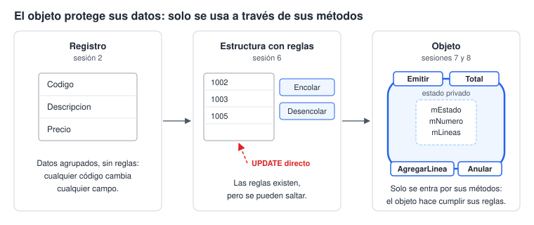
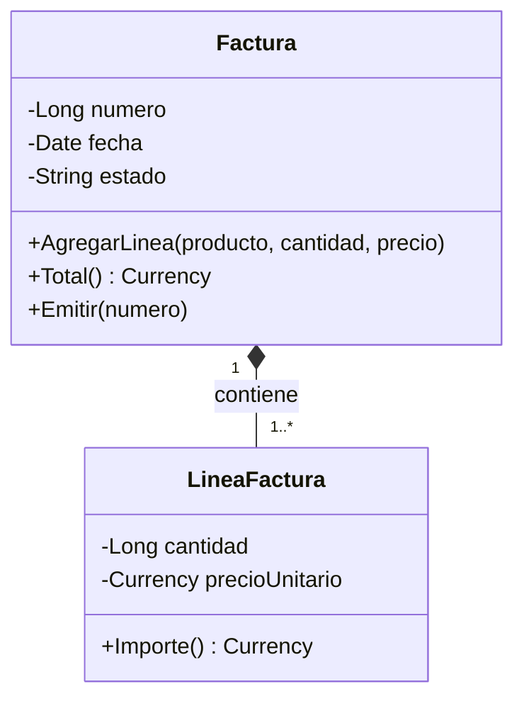
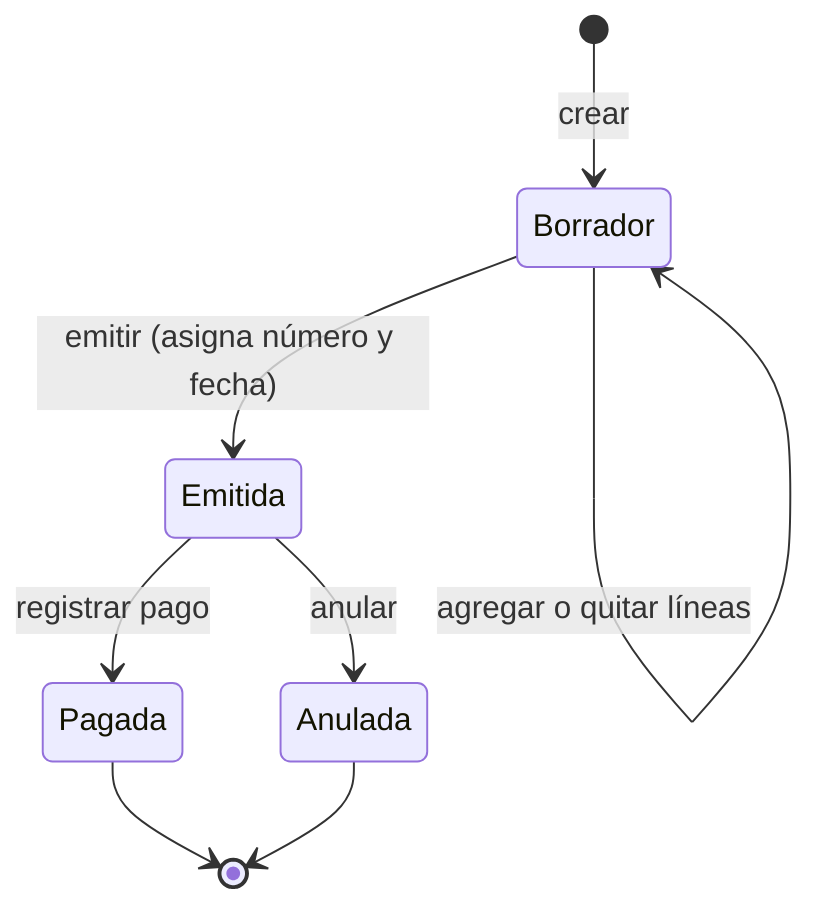

# Laboratorio 7 · Pensar en objetos: del problema a las clases

Hoy aprendes a leer un problema y descubrir en él objetos con responsabilidades. Es el paso de preguntarte «¿qué datos guardo?» a preguntarte «¿quién sabe hacer qué?». Casi toda la sesión se trabaja en papel.

## Objetivos

- Explicar qué es un objeto (identidad, estado y comportamiento) y en qué se diferencia de un registro.
- Descubrir clases candidatas en un enunciado con el análisis de sustantivos y verbos.
- Asignar responsabilidades y colaboraciones con tarjetas CRC y comprobarlas con un juego de roles.
- Modelar clases, asociaciones y composición con un diagrama de clases, y el ciclo de vida con un diagrama de estados.
- Comparar el modelo relacional con el modelo de objetos del mismo problema.

## Conceptos

**Por qué hacen falta objetos.** En la sesión 5 el formulario te dejó modificar una factura pagada y emitir otra sin líneas. Las reglas existían, pero nadie las hacía cumplir. En la sesión 6 la cola y la pila tenían reglas de acceso, pero cualquiera podía saltarlas con un `UPDATE` directo.

**Objeto.** Un objeto tiene identidad (es esta factura y no otra), estado (sus datos en este momento) y comportamiento (lo que sabe hacer). Una clase es la plantilla que describe a todos los objetos de un tipo.

**Encapsulamiento.** El objeto guarda su estado en privado y solo deja cambiarlo a través de sus métodos. Así valida cada cambio: una factura emitida rechaza una línea nueva por sí misma, sin depender de que el formulario lo recuerde.

> **Conexión:** un objeto es un registro (sesión 2) más las operaciones de un TAD (sesión 6), con los datos protegidos. Es la última etapa del hilo evolutivo del curso.

**Responsabilidad y colaboración.** Una responsabilidad es algo que la clase sabe o sabe hacer. Una colaboración es otra clase a la que le pide ayuda para cumplirla: la factura calcula su total pidiéndole a cada línea su importe.

| Heurística | Pregunta que responde | Ejemplo en el sistema |
| --- | --- | --- |
| Experto en información | ¿Quién tiene los datos para hacer esto? | La línea calcula su importe; la factura, su total |
| Encapsulamiento | ¿Quién protege esta regla? | La factura impide cambios después de emitida |
| Alta cohesión | ¿Esta clase hace una sola cosa bien? | Guardar en la base no es tarea de la factura, sino de un repositorio |

## El método en cinco pasos

Así se enseña a pensar en objetos: no se empieza por el código, sino por el lenguaje del problema.

1. Lee el enunciado y subraya sustantivos (candidatos a clases o atributos) y verbos (candidatos a responsabilidades).
2. Filtra los candidatos: sinónimos, atributos, valores calculados y cosas fuera del sistema.
3. Escribe una tarjeta CRC por clase: nombre, responsabilidades y colaboradores.
4. Recorre escenarios con un juego de roles: cada persona es una clase y solo puede hacer lo que dice su tarjeta.
5. Dibuja los diagramas de clases y de estados, y compáralos con el modelo entidad-relación.

## El enunciado

> Distribuidora Aula vende productos de tecnología y papelería. Cada producto tiene un código, una descripción, una categoría y un precio de venta que puede cambiar. Los clientes se identifican por su documento fiscal y tienen razón social, dirección y datos de contacto. Cuando un cliente compra, el vendedor crea una factura en borrador y le agrega líneas. Cada línea indica un producto, la cantidad y el precio unitario vigente. Mientras la factura está en borrador se pueden agregar o quitar líneas y cambiar el cliente. Al emitirla, el sistema le asigna el siguiente número consecutivo y la fecha del día. Una factura sin cliente o sin líneas no puede emitirse. Una factura emitida ya no puede modificarse: solo puede pagarse o anularse. El sistema calcula el importe de cada línea, el subtotal, el impuesto según la tasa vigente y el total.

## Paso a paso

### Parte A · Sustantivos y verbos (25 min, individual y luego en parejas)

1. Copia el enunciado y subraya con un color los sustantivos y con otro los verbos.
2. Clasifica cada sustantivo en una tabla como esta:

| Sustantivo | Clasificación | Razón |
| --- | --- | --- |
| Factura | Clase | Tiene datos propios y comportamiento |
| Cantidad | Atributo de la línea | Es un valor simple, sin comportamiento |
| Total | Valor calculado | Se obtiene de otros datos |
| Vendedor | Fuera de alcance | Usa el sistema; en este curso no se guardan sus datos |

3. Agrupa los verbos bajo la clase que debería responsabilizarse de cada uno.

> **Ojo:** no todos los sustantivos son clases. Si algo no tiene datos propios ni comportamiento, probablemente es un atributo.

### Parte B · Tarjetas CRC (25 min, en equipos)

1. Divide una hoja por clase candidata en tres zonas: nombre, responsabilidades y colaboradores.
2. Usa este ejemplo resuelto como guía:

| Clase: LineaFactura | Colaboradores |
| --- | --- |
| Conocer su producto, su cantidad y su precio pactado | Producto |
| Calcular su importe | Ninguno |
| Rechazar una cantidad menor o igual a cero | Ninguno |

3. Completa las tarjetas de Factura, Producto, Cliente y Categoría.
4. Pregunta: ¿quién guarda las facturas en la base y quién sabe el siguiente número? Si hace falta una clase que no está en el enunciado, crea su tarjeta.

### Parte C · Juego de roles (20 min)

Cada integrante toma una tarjeta y actúa como esa clase. Solo puede hacer lo que dice su tarjeta; si necesita algo de otra clase, se lo pide en voz alta. Recorran estos escenarios:

1. ¿Cuánto es el total de la factura 1003?
2. Emite el borrador de Talleres Mecánicos Rodríguez.
3. Agrega un ratón óptico a la factura 1003, que ya está emitida.

Si en un escenario nadie puede responder, falta una responsabilidad: corrijan las tarjetas y repitan.

### Parte D · Diagrama de clases (20 min)

1. Parte de este inicio en [mermaid.live](https://mermaid.live):

2. Lee la notación: `-` es privado y `+` es público. `*--` es composición (rombo lleno): las líneas nacen y mueren con su factura. `-->` es asociación: la factura conoce a su cliente, pero el cliente existe sin ella.
3. Agrega Cliente, Producto y Categoría con sus asociaciones y multiplicidades.
4. Agrega a Factura los métodos que faltan según tus tarjetas: quitar líneas, subtotal, impuesto, registrar pago y anular.

### Parte E · Diagrama de estados (15 min)

Este es el ciclo de vida de una factura según el enunciado:

1. Escribe junto a cada transición el método de Factura que la provoca.
2. Lista tres transiciones que no aparecen, como de Pagada a Borrador, e indica qué método debe rechazarlas.

### Parte F · Relacional frente a objetos (15 min)

| Aspecto | Modelo relacional | Modelo de objetos |
| --- | --- | --- |
| Unidad | Tabla: un conjunto de filas | Clase como plantilla; objeto como instancia |
| Identidad | El valor de la clave principal | La identidad del objeto en memoria |
| Vínculos | Claves foráneas que se siguen con `JOIN` | Referencias y colecciones, como `factura.Linea(1)` |
| Comportamiento | Fuera de la tabla: consultas, formularios y código | Dentro del objeto: sus métodos |
| Reglas | Tipos, validaciones e integridad referencial | Encapsulamiento: el objeto valida cada cambio |
| Datos calculados | Campos calculados en consultas | Propiedades calculadas, como `Total` |
| Composición | Relación con eliminación en cascada | Rombo lleno en el diagrama de clases |
| Muchos a muchos | Tabla intermedia | Clase intermedia (`LineaFactura`) o colecciones en ambos lados |

Discute con tu equipo: ¿qué pasa si una regla vive solo en el formulario? ¿Y si vive solo en el objeto, pero alguien edita la tabla directamente?

## Puntos de control

- [ ] Tu tabla de sustantivos identifica 5 clases candidatas y explica por qué descartaste Vendedor y Sistema.
- [ ] Cada tarjeta CRC tiene al menos dos responsabilidades y sus colaboradores.
- [ ] En el juego de roles, el escenario 3 termina con la factura rechazando la línea.
- [ ] Tu diagrama de clases distingue la composición Factura–LineaFactura de las asociaciones con Cliente y Producto.

## Tarea 7 · Modela los pagos parciales

Nuevo requisito: un cliente puede pagar una factura en varios abonos. Cada abono tiene fecha, monto y forma de pago. La factura queda pagada cuando la suma de sus abonos iguala el total, y ningún abono puede superar el saldo pendiente.

1. Haz el análisis de sustantivos y verbos del requisito.
2. Escribe las tarjetas CRC nuevas o modificadas. ¿Quién calcula el saldo? ¿Quién decide que la factura pasa a Pagada?
3. Actualiza el diagrama de clases en Mermaid.
4. Actualiza el diagrama de estados. ¿Hace falta un estado nuevo?
5. Indica qué tablas y relaciones agregarías al modelo relacional para guardar los abonos.

## Autoevaluación

1. ¿En qué se diferencia un objeto de un registro?
2. ¿Por qué el total es un método y no un atributo guardado?
3. ¿Qué significa el rombo lleno entre Factura y LineaFactura?
4. Da un ejemplo de clase que no aparece como sustantivo en el enunciado y explica por qué hace falta.
