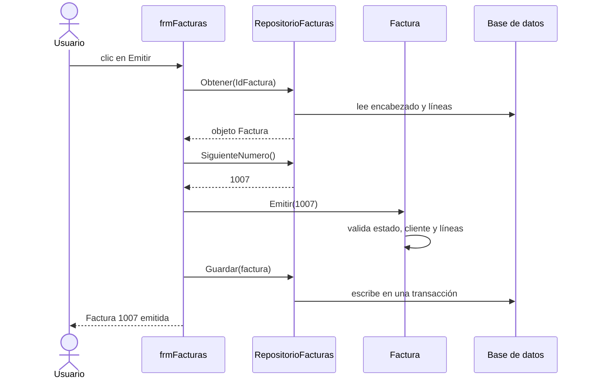

# Laboratorio 8 · Objetos en acción: clases en VBA

Hoy conviertes el diseño de la sesión 7 en clases de VBA. Al terminar, la factura protege sus propias reglas y el formulario solo le pide que se emita.

## Objetivos

- Crear módulos de clase con estado privado, propiedades y métodos.
- Implementar la composición: una factura que contiene una colección de líneas.
- Hacer cumplir el ciclo de vida de la factura dentro del objeto, con errores cuando una operación no está permitida.
- Separar la lógica del negocio de la persistencia con una clase repositorio.
- Conectar el formulario con los objetos.

## Conceptos

**Clases en VBA.** Un módulo de clase define una clase. Sus variables privadas son el estado, sus propiedades exponen datos y sus procedimientos públicos son los métodos.

| Concepto | En VBA | Ejemplo de uso |
| --- | --- | --- |
| Estado privado | `Private mEstado As String` | Nadie fuera de la clase lo cambia |
| Propiedad de lectura | `Public Property Get Total() As Currency` | `f.Total` |
| Propiedad de escritura con validación | `Public Property Let IdCliente(ByVal valor As Long)` | `f.IdCliente = 2` |
| Método | `Public Sub Emitir(ByVal numero As Long)` | `f.Emitir 1007` |
| Crear un objeto | `Set f = New clsFactura` | Ejecuta `Class_Initialize` |
| Error de negocio | `Err.Raise vbObjectError + 2005, ...` | Rechaza una operación |

**Sin constructores con parámetros.** VBA no permite pasar datos al crear un objeto. Por eso `clsLineaFactura` tiene un método `Inicializar` que valida los datos de la línea.

**Composición con una colección.** `clsFactura` guarda sus líneas en una `Collection` privada. Nadie de afuera puede agregar una línea sin pasar por `AgregarLinea`, que primero revisa el estado.

**Repositorio.** La factura no sabe SQL. `clsRepositorioFacturas` traduce entre objetos y tablas: `Obtener` arma el objeto desde la base y `Guardar` lo escribe en una transacción. Es la alta cohesión de la sesión 7.

> **Conexión:** esa traducción se llama mapeo objeto-relacional (ORM). Herramientas como Entity Framework o Hibernate la automatizan; aquí la escribes a mano para entenderla.

Así colaboran los objetos cuando pulsas Emitir:



## Paso a paso

### Parte A · Importa los módulos (10 min)

1. Importa en este orden: `modConstantes.bas`, `clsLineaFactura.cls`, `clsFactura_plantilla.cls`, `clsRepositorioFacturas.cls` y `modPruebasObjetos.bas`.
2. La plantilla aparece como `clsFactura`: ese es el nombre de la clase.
3. Compila con Depuración → Compilar. La plantilla compila, aunque le faltan tres partes.

### Parte B · Lee la clase LineaFactura (15 min)

```vb
' clsLineaFactura: un producto, su cantidad y el precio pactado
Private mIdProducto As Long
Private mDescripcion As String
Private mCantidad As Long
Private mPrecioUnitario As Currency

Public Sub Inicializar(ByVal idProducto As Long, ByVal descripcion As String, _
                       ByVal cantidad As Long, ByVal precioUnitario As Currency)
    If cantidad <= 0 Then Err.Raise vbObjectError + 1001, "LineaFactura", _
        "La cantidad debe ser mayor que cero."
    If precioUnitario < 0 Then Err.Raise vbObjectError + 1002, "LineaFactura", _
        "El precio no puede ser negativo."
    mIdProducto = idProducto
    mDescripcion = descripcion
    mCantidad = cantidad
    mPrecioUnitario = precioUnitario
End Sub

Public Property Get Cantidad() As Long
    Cantidad = mCantidad
End Property

' Experto en información: la línea calcula su propio importe
Public Property Get Importe() As Currency
    Importe = mCantidad * mPrecioUnitario
End Property
```

Las propiedades `IdProducto`, `Descripcion` y `PrecioUnitario` siguen el mismo patrón que `Cantidad`. Responde: ¿por qué no hay un `Property Let` para la cantidad?

### Parte C · Completa la clase Factura (35 min)

Lee primero lo que ya está hecho. `AgregarLinea` muestra el patrón: revisa la regla y después cambia el estado.

```vb
Public Sub AgregarLinea(ByVal idProducto As Long, ByVal descripcion As String, _
                        ByVal cantidad As Long, ByVal precioUnitario As Currency)
    Dim nueva As clsLineaFactura
    ExigirBorrador "agregar líneas"
    If ExisteLinea(idProducto) Then Err.Raise vbObjectError + 2003, "Factura", _
        "El producto ya está en la factura: cambia la cantidad de su línea."
    Set nueva = New clsLineaFactura
    nueva.Inicializar idProducto, descripcion, cantidad, precioUnitario
    mLineas.Add nueva, CStr(idProducto)
End Sub

Private Sub ExigirBorrador(ByVal accion As String)
    If mEstado <> ESTADO_BORRADOR Then Err.Raise vbObjectError + 2000, "Factura", _
        "Operación no permitida (" & accion & "): la factura está " & LCase(mEstado) & "."
End Sub
```

Completa las tres partes marcadas con TODO:

```vb
Public Property Get Subtotal() As Currency
    ' TODO 1: recorre mLineas con For Each y suma el Importe de cada línea.
End Property

Public Sub Emitir(ByVal numeroAsignado As Long)
    ExigirBorrador "emitir"
    ' TODO 2: si no hay cliente (mIdCliente = 0) lanza el error 2004;
    '         si no hay líneas (mLineas.Count = 0) lanza el error 2005.
    mNumero = numeroAsignado
    mFecha = Date
    mEstado = ESTADO_EMITIDA
End Sub

Public Sub Anular()
    ' TODO 3: si la factura no está emitida lanza el error 2007;
    '         si lo está, cambia mEstado a ESTADO_ANULADA.
End Sub
```

> **Ojo:** usa `vbObjectError + n` para tus errores. Así no chocan con los números de error propios de VBA.

### Parte D · Prueba en memoria (15 min)

1. En la ventana Inmediato ejecuta `ProbarFactura`. Arma en memoria una factura igual a la 1003, la emite e intenta agregarle una línea. Debes ver algo así:

```text
Subtotal:      9146.7
Impuesto:      1463.47
Total:         10610.17
Rechazo:      Operación no permitida (agregar líneas): la factura está emitida.
```

2. Ejecuta `ProbarReglas`. Prueba cinco reglas del ciclo de vida y escribe Correcto o FALLA en cada una.
3. Corrige tus TODO hasta que las cinco digan Correcto.

> **Concepto:** `ProbarReglas` es una prueba automatizada. Cada vez que cambies la clase, vuelve a ejecutarla para confirmar que no rompiste nada.

### Parte E · Del objeto a la base y de vuelta (10 min)

1. Ejecuta `ProbarRepositorio`. Carga desde la base la factura con `IdFactura` 3 y muestra sus líneas y totales.
2. Comprueba que el total es 10610.17, el mismo de `qryTotalesFactura`. Son dos caminos, la consulta de la sesión 4 y el objeto de hoy, con el mismo resultado.

### Parte F · Conecta el formulario (20 min)

1. Agrega a `frmFacturas` un botón `cmdEmitir` con este evento Al hacer clic:

```vb
Private Sub cmdEmitir_Click()
    Dim repo As clsRepositorioFacturas, f As clsFactura
    On Error GoTo Falla
    If Me.Dirty Then Me.Dirty = False              ' guarda la edición pendiente
    Set repo = New clsRepositorioFacturas
    Set f = repo.Obtener(Me.IdFactura)
    f.Emitir repo.SiguienteNumero()                ' la factura decide si puede emitirse
    repo.Guardar f
    Me.Refresh
    Form_Current                                   ' vuelve a aplicar el bloqueo
    MsgBox "Factura " & f.Numero & " emitida. Total: " & Format(f.Total, "Currency"), vbInformation
    Exit Sub
Falla:
    MsgBox Err.Description, vbExclamation, "No se pudo emitir"
End Sub
```

2. Reemplaza el `Form_Current` del laboratorio 5 por esta versión, que bloquea la edición de facturas que ya no son borrador:

```vb
Private Sub Form_Current()
    Dim editable As Boolean
    editable = (Nz(Me.Estado, ESTADO_BORRADOR) = ESTADO_BORRADOR)
    Me.AllowEdits = editable
    With Me.sfrmDetalleFactura.Form           ' usa el nombre de tu control de subformulario
        .AllowEdits = editable
        .AllowAdditions = editable
        .AllowDeletions = editable
    End With
    ActualizarTotales
End Sub
```

3. Abre el borrador de Talleres Mecánicos Rodríguez y pulsa Emitir. Debe recibir el número 1007 con total 16,643.68.
4. Pulsa Emitir otra vez: el objeto responde que la factura ya está emitida.
5. Haz la copia de seguridad de la base.

> **Ojo:** el formulario todavía escribe directo en las tablas. Bloquear la interfaz ayuda, pero la regla completa vive en el objeto; en un sistema real, toda escritura pasaría por él.

### Para ir más allá · Polimorfismo con interfaces (opcional)

VBA no tiene herencia, pero sí interfaces con `Implements`. Importa `IDescuento.cls`, `clsSinDescuento.cls`, `clsDescuentoPorcentaje.cls` y `modPolimorfismo.bas`, y ejecuta `ProbarDescuentos`.

```vb
Public Sub ProbarDescuentos()
    Dim d As IDescuento, p As clsDescuentoPorcentaje
    Set d = New clsSinDescuento
    Debug.Print d.Descripcion, d.Calcular(1000)      ' Sin descuento   0
    Set p = New clsDescuentoPorcentaje
    p.Inicializar 0.1
    Set d = p                                        ' la misma variable, otro comportamiento
    Debug.Print d.Descripcion, d.Calcular(1000)      ' Descuento del 10%   100
End Sub
```

El código que llama a `d.Calcular` no sabe qué clase está usando: eso es el polimorfismo.

## Puntos de control

- [ ] `ProbarFactura` muestra 9146.7, 1463.47 y 10610.17.
- [ ] `ProbarReglas` muestra Correcto en las cinco reglas.
- [ ] `ProbarRepositorio` muestra la factura 1003 con total 10610.17.
- [ ] El botón Emitir asigna el número 1007 al borrador de Talleres Mecánicos Rodríguez y rechaza emitirlo de nuevo.

## Tarea 8 · Proyecto integrador

La tarea de esta sesión es el proyecto integrador. Sus opciones, entregables y rúbrica están en [proyecto_integrador.md](proyecto_integrador.md).

## Autoevaluación

1. ¿Por qué `mLineas` es privada y qué pasaría si fuera pública?
2. ¿Por qué `clsLineaFactura` no tiene un `Property Let` para la cantidad?
3. ¿Qué ganas al separar `clsFactura` de `clsRepositorioFacturas`?
4. En el botón Emitir, ¿quién decide si la factura puede emitirse: el formulario o el objeto?
5. Dibuja el hilo evolutivo del curso, de dato a objeto, con un ejemplo de este sistema en cada etapa.
