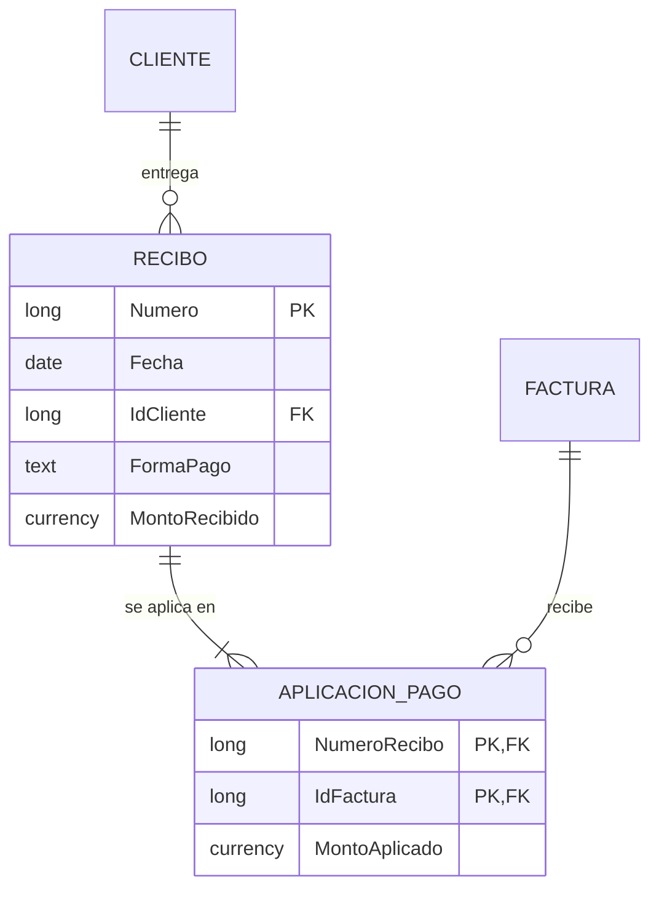

# Sesión 1 · Del papel a los datos

El momento clave llega cuando el grupo descubre que el total de la factura no se guarda: se calcula.

## Agenda (120 min)

| Minutos | Actividad | Notas |
| --- | --- | --- |
| 0–10 | Presentación del curso y del hilo evolutivo | Proyecta la factura 1001 |
| 10–35 | Parte A: análisis de la factura | 10 min individual, 15 en parejas |
| 35–55 | Parte B: ubicación de confianza y base nueva | Recorre el aula buscando la barra amarilla |
| 55–70 | Parte C: recorrido por la interfaz | Demostración en el proyector |
| 70–95 | Parte D: modelo entidad-relación en Mermaid | Dos parejas muestran su diagrama |
| 95–110 | Puesta en común | Entidad, atributo, registro, dato calculado |
| 110–120 | Tarea 1 y autoevaluación | |

## Guion

- Abre con una pregunta: «¿Cuántos datos distintos hay en esta factura?». Suelen contar entre 20 y 25.
- Provoca: «¿Guardamos el total?». Deja que alguien diga sí y pregunta qué pasa si se corrige una cantidad.
- Los datos del emisor anticipan la tabla de parámetros de la sesión 4: un registro único que se repite en todas las facturas.

## Preguntas para la discusión

| Pregunta | Respuesta esperada |
| --- | --- |
| ¿El emisor es una entidad? | Sí, pero con un solo registro: irá a `tblParametros` |
| ¿La descripción del producto pertenece a la línea? | No: depende del producto; la línea solo lo referencia |
| ¿Qué identifica a una línea? | La factura más el producto |

## Errores frecuentes

| Síntoma | Causa | Solución |
| --- | --- | --- |
| No se puede agregar la ubicación de confianza | Directiva de la institución | Pedirlo a TI o usar Habilitar contenido mientras tanto |
| La base quedó en Documentos | No se eligió la carpeta al crearla | Crearla de nuevo en `C:\CursoED` |
| La carpeta del curso está en OneDrive | Escritorio o Documentos sincronizados | Usar `C:\CursoED` en el disco local |
| Mermaid marca error | Acentos o espacios en nombres de entidad | Usar nombres como `LINEA_FACTURA` |

## Solución de la tarea 1

Entidades: Cliente, Recibo, Factura y Aplicación de pago. Un recibo cubre varias facturas y una factura puede pagarse con varios recibos: la relación muchos a muchos se resuelve con Aplicación de pago, que guarda el monto aplicado.

Datos calculados: el saldo pendiente de cada factura. Regla que vale la pena señalar: la suma de los montos aplicados debe igualar el monto recibido.

## Respuestas de la autoevaluación

1. Es un dato derivado: si cambia una cantidad, un total guardado queda inconsistente.
2. La entidad es el tipo de cosa (Cliente); el registro es una ocurrencia (el cliente 1).
3. Aparece la barra amarilla y el código VBA no se ejecuta hasta habilitar el contenido.
4. Cada factura tiene exactamente un cliente; un cliente tiene cero o muchas facturas.
