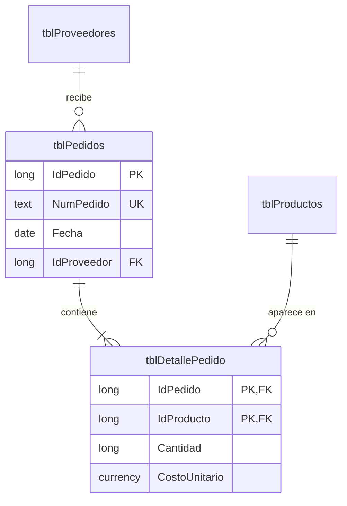

# Sesión 3 · Normalización y relaciones

El momento clave es la fila 1004 de `factura_plana.csv`: el mismo cliente escrito de dos formas hace visible la anomalía de actualización.

## Agenda (120 min)

| Minutos | Actividad | Notas |
| --- | --- | --- |
| 0–20 | Parte A: tabla plana | Proyecta el CSV y marca las repeticiones |
| 20–40 | Parte B: normalización en papel | En la pizarra, forma por forma |
| 40–70 | Parte C: tablas nuevas | La clave compuesta es el punto difícil |
| 70–95 | Parte D: relaciones | Justifica la única cascada |
| 95–110 | Partes E y F: carga y pruebas | Deja que fallen al cargar el detalle primero |
| 110–120 | Grafo y orden topológico; tarea 3 | |

## Guion

- La clave foránea es un puntero por valor; la integridad referencial prohíbe referencias colgantes.
- La cascada entre facturas y detalle es una composición: se retoma en la sesión 7 como el rombo lleno.
- El diagrama de relaciones es un grafo; cargar en el orden correcto es recorrerlo en orden topológico.

## Preguntas para la discusión

| Pregunta | Respuesta esperada |
| --- | --- |
| ¿`PrecioUnitario` en el detalle viola 3FN? | No: es el precio pactado en esa venta y depende de la línea completa |
| ¿Una tabla cuya única clave es un solo campo puede violar 2FN? | No: una dependencia parcial necesita una clave compuesta |
| ¿Qué dependencia permite que la fila 1004 escriba al cliente de otra forma? | La transitiva `NumFactura → DocCliente → Cliente, CiudadCliente`: los datos del cliente se copian en cada factura y cada copia puede escribirse distinto |
| ¿La columna `Total` viola alguna forma normal? | En la tabla de líneas rompe 2FN, porque depende solo de `NumFactura`. En la de facturas cumple 3FN, pero se elimina porque se calcula y puede contradecir a las líneas |
| ¿Por qué no hay cascada de clientes a facturas? | Las facturas son documentos que no deben desaparecer al borrar un cliente |
| ¿Qué es una relación muchos a muchos en estructuras? | Dos listas de referencias; la tabla intermedia guarda los pares |

Si el grupo leyó la parte opcional «Para ir más allá · Formas normales superiores» del laboratorio:

| Pregunta | Respuesta esperada |
| --- | --- |
| ¿Qué caso deja pasar 3FN y prohíbe FNBC? | Un campo que por sí solo no es clave y determina una parte de una clave, como `Ejecutivo → Categoria` |
| ¿Por qué un diseño puede quedarse en 3FN a propósito? | Llegar a FNBC puede perder una regla que garantizaba una clave: un solo ejecutivo por cliente y categoría |
| La tabla de teléfonos y correos cumple FNBC. ¿Qué problema tiene? | Junta dos listas independientes: un correo nuevo exige una fila por cada teléfono |
| ¿Por qué el ejemplo de 5FN necesita tres tablas y no dos? | Al unir solo dos aparecen filas falsas, como (Tecnodistribución, Accesorios, Puerto Azul); la tercera las filtra |

## Errores frecuentes

| Síntoma | Causa | Solución |
| --- | --- | --- |
| Access no crea la relación por tipos distintos | La clave foránea no es Entero largo | Cambiarla a Número, Entero largo |
| «Los datos infringen la integridad referencial» | Productos con categorías que aún no existen | Importar las categorías antes de relacionar |
| La clave compuesta quedó en un solo campo | Se seleccionó una sola fila | Seleccionar ambas filas con Ctrl |
| Importar facturas falla en `NumeroFactura` | Se importó dos veces | Vaciar la tabla e importar una vez |
| Regla de `Estado` rechazada | Idioma de Access | Forma en español: `"Borrador" O "Emitida" O …` |

## Solución de la tarea 3

Anomalías: actualización (Suministros Lema tiene dos teléfonos), inserción (un proveedor sin pedidos no se puede registrar) y borrado (borrar P-03 elimina a Tecnodistribución).

La cascada va entre pedidos y su detalle (composición). El total del pedido se calcula: P-01 5,850.00; P-02 3,300.00; P-03 12,800.00.

## Respuestas de la autoevaluación

1. Anomalía de actualización.
2. Es el precio histórico de la venta.
3. Las facturas son documentos independientes con valor legal.
4. Categorías y clientes, luego productos y facturas, al final el detalle.
