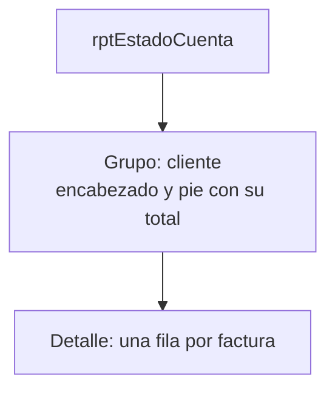

# Sesión 5 · Maestro-detalle e informe

El momento clave está al final: el grupo rompe a propósito dos reglas del negocio, y esa incomodidad motiva las sesiones 7 y 8.

## Agenda (120 min)

| Minutos | Actividad | Notas |
| --- | --- | --- |
| 0–10 | La factura como árbol | Dibuja el árbol de la factura 1003 |
| 10–35 | Parte A: formulario con subformulario | Asistente para formularios |
| 35–55 | Parte B: cuadros combinados | Ancho 0 cm: mostrar el nombre, guardar la clave |
| 55–85 | Parte C: eventos | Primer contacto con VBA en formularios |
| 85–105 | Partes D y E: informe e impresión | Si falta tiempo, el informe pasa a la tarea |
| 105–120 | Parte F: reglas rotas; tarea 5 | No la omitas: es el puente hacia los objetos |

## Guion

- Programación por eventos: el código no corre de arriba abajo, sino cuando algo ocurre.
- `Me` y `Me.Parent` son los primeros objetos que usan: tienen propiedades y métodos.
- Cierra con la pregunta: «¿Quién debería impedir que se modifique una factura pagada?». Déjala sin responder.

## Preguntas para la discusión

| Pregunta | Respuesta esperada |
| --- | --- |
| ¿Qué hacen los campos vinculados del subformulario? | Filtran las líneas por `IdFactura` y asignan ese valor a las líneas nuevas |
| ¿Por qué `ActualizarTotales` usa `DSum` en VBA? | Funciona igual en cualquier idioma de Access y no depende de controles del subformulario |
| ¿Quién debería impedir modificar una factura pagada? | Pregunta abierta: prepara la sesión 7 |

## Errores frecuentes

| Síntoma | Causa | Solución |
| --- | --- | --- |
| El precio no se copia | El combo tiene 2 columnas o el evento está en otro control | Número de columnas 3; evento en `IdProducto` |
| Error 2452 con `Parent` | Se abrió el subformulario solo | Abrir `frmFacturas` |
| Totales en blanco | Nombres de cuadros distintos o falta `Form_Current` | Revisar `txtSubtotal`, `txtImpuesto` y `txtTotal` |
| Varias facturas por página | Falta Forzar nueva página | Pie del grupo: Después de la sección |
| El botón imprime todas las facturas | Falta la condición de filtro | Revisar el cuarto argumento de `OpenReport` |
| Una factura no aparece en el informe | No tiene líneas y la unión es interna | Es lo esperado; ver el reto de la sesión 4 |

## Solución de la tarea 5

`rptEstadoCuenta` sobre `qryTotalesFactura` filtrada a Emitida y Pagada, agrupado por `RazonSocial`, con número, fecha, estado y total en el detalle y la suma de `Total` en el pie del grupo. Los totales por cliente coinciden con `qryVentasPorCliente`.

Reglas que el formulario deja romper y dónde deberían vivir: «no modificar una factura emitida» y «no emitir sin líneas» pertenecen a la factura misma (sesiones 7 y 8). Como defensa adicional, Access permite macros de datos Antes del cambio en la tabla.

## Respuestas de la autoevaluación

1. `IdFactura`: une cada línea con su encabezado.
2. Guarda `IdCliente` y muestra la razón social.
3. Es el precio histórico de la venta.
4. Encabezado del grupo, detalle y pie del grupo.
