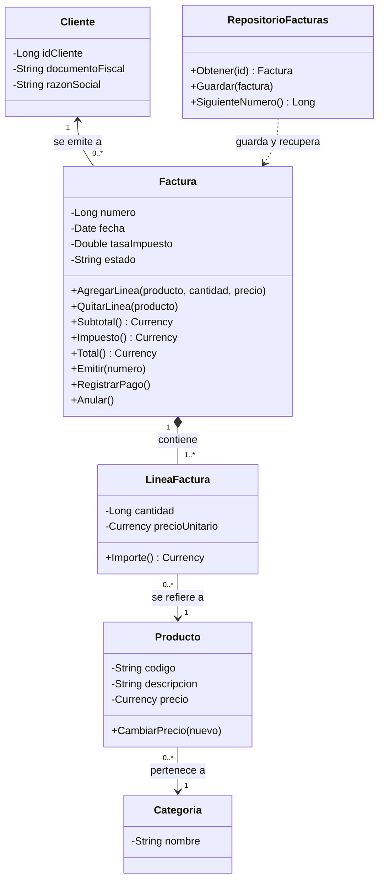
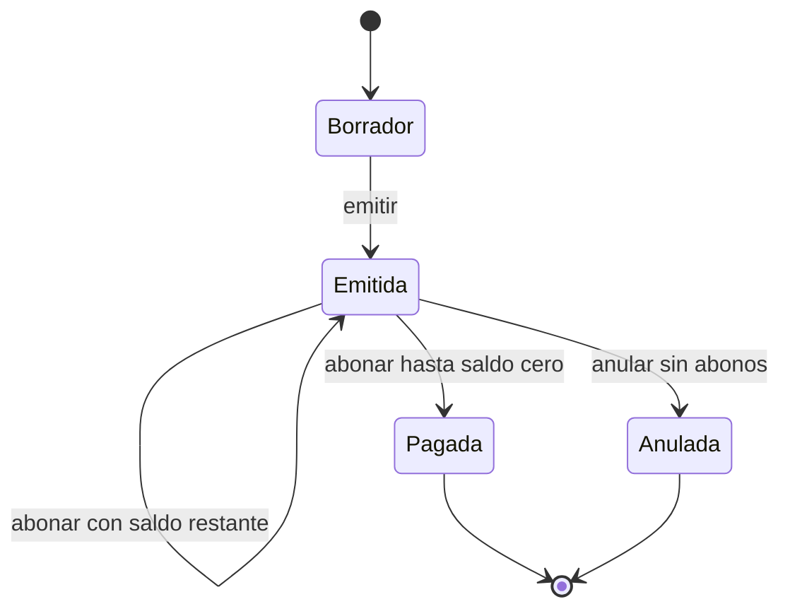

# Sesión 7 · Pensar en objetos

La sesión enseña a pensar en objetos antes de programarlos: el grupo descubre las clases en el lenguaje del problema y las pone a prueba actuándolas.

## Agenda (120 min)

| Minutos | Actividad | Notas |
| --- | --- | --- |
| 0–15 | Motivación: reglas rotas en la sesión 5 y el `UPDATE` de la sesión 6 | Proyecta la factura 1001 modificada |
| 15–40 | Parte A: sustantivos y verbos | 10 min individual, 15 en parejas |
| 40–65 | Parte B: tarjetas CRC | Equipos de 3 o 4 |
| 65–85 | Parte C: juego de roles | Tú narras; los equipos actúan |
| 85–100 | Parte D: diagrama de clases | |
| 100–110 | Parte E: diagrama de estados | |
| 110–120 | Parte F y cierre; tarea 7 | |

## Cómo conducir el juego de roles

1. Cada integrante sostiene su tarjeta. Tú enuncias el escenario.
2. Solo habla la clase que recibe un mensaje, y responde leyendo su tarjeta.
3. Si una clase necesita algo, lo pide por nombre: «LineaFactura 1, ¿cuál es tu importe?».
4. Si nadie tiene la responsabilidad, detén la escena y corrijan una tarjeta.
5. Al final pregunta: ¿alguna clase hizo demasiado? ¿Alguna no hizo nada?

Guion esperado de los escenarios:

- **Total de la 1003.** Factura pide su importe a cada LineaFactura, suma el subtotal, aplica su tasa y devuelve el total.
- **Emitir el borrador.** Factura revisa estado, cliente y líneas. Alguien debe dar el siguiente número: como ninguna clase del enunciado conoce todas las facturas, aparece RepositorioFacturas.
- **Agregar a la 1003 emitida.** Factura rechaza la línea por sí misma: eso es encapsulamiento.

## Solución esperada del análisis

| Sustantivo del enunciado | Clasificación |
| --- | --- |
| Distribuidora Aula | Fuera de alcance como clase: sus datos van a parámetros |
| Producto | Clase |
| Código, descripción, precio de venta | Atributos de Producto |
| Categoría | Clase (forma un árbol) |
| Cliente | Clase |
| Documento fiscal, razón social, dirección, contacto | Atributos de Cliente |
| Vendedor | Fuera de alcance: es un actor |
| Factura | Clase |
| Borrador, emitida, pagada, anulada | Valores del atributo estado |
| Línea | Clase `LineaFactura` |
| Cantidad, precio unitario | Atributos de LineaFactura |
| Número consecutivo, fecha, tasa | Atributos de Factura |
| Importe, subtotal, impuesto, total | Valores calculados: métodos |
| Sistema | Fuera de alcance: es el todo |

Verbos: agregar y quitar líneas, cambiar el cliente, emitir, pagar y anular van a Factura; calcular el importe va a LineaFactura; cambiar el precio va a Producto. Vender y comprar describen el escenario, no son métodos.

## Tarjetas CRC esperadas

| Clase: Factura | Colaboradores |
| --- | --- |
| Conocer cliente, fecha, número, tasa y estado | Cliente |
| Agregar y quitar líneas solo en borrador | LineaFactura |
| Calcular subtotal, impuesto y total | LineaFactura |
| Emitirse: validar cliente y líneas, aceptar número y fecha | RepositorioFacturas, que provee el número |
| Registrar pago y anularse según su estado | Ninguno |

| Clase: RepositorioFacturas | Colaboradores |
| --- | --- |
| Obtener y guardar facturas con sus líneas | Factura, LineaFactura, base de datos |
| Proveer el siguiente número consecutivo | Base de datos |

## Diagrama de clases esperado

Categoría también se relaciona consigo misma (subcategoría de); se omite del diagrama para no recargarlo.

## Errores conceptuales frecuentes

| Error | Síntoma en las tarjetas | Cómo reconducirlo |
| --- | --- | --- |
| Clase igual a tabla | Tarjetas con datos y sin responsabilidades | Preguntar «¿qué sabe hacer?» |
| Clase dios | Factura guarda en la base, imprime y calcula todo | Aplicar alta cohesión: separar el repositorio |
| Atributo inflado a clase | Tarjetas para Cantidad o Total | Preguntar si tiene comportamiento propio |
| Herencia prematura | «Factura hereda de Cliente» | Distinguir «es un» de «tiene un» |
| Verbos del usuario como métodos | Vender o comprar en Factura | Son escenarios, no responsabilidades |

## Solución de la tarea 7

- Nueva clase Abono (fecha, monto, forma de pago), en composición con Factura: `Factura "1" *-- "0..*" Abono`.
- Factura agrega `RegistrarAbono(monto, forma)` y `Saldo()`, igual al total menos los abonos. Rechaza abonos si no está emitida, si el monto es 0 o si supera el saldo.
- Factura decide pasar a Pagada cuando el saldo llega a 0: es la experta en su saldo.
- Estados: basta Emitida con saldo pendiente; un estado nuevo, como Parcial, también es válido si se justifica.
- Tabla `tblAbonos` (IdAbono, IdFactura, Fecha, Monto, FormaPago) relacionada con `tblFacturas`, sin cascada.

## Respuestas de la autoevaluación

1. El objeto agrega comportamiento y protege su estado; el registro solo agrupa datos.
2. Se deriva de las líneas: guardarlo permitiría inconsistencias.
3. Composición: las líneas no existen fuera de su factura.
4. RepositorioFacturas: nadie del enunciado conoce todas las facturas ni el siguiente número.
